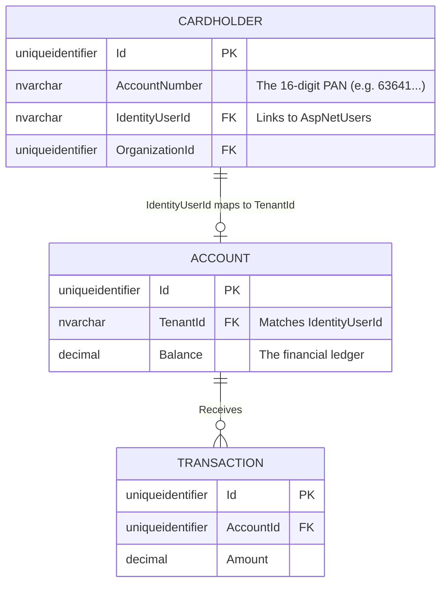
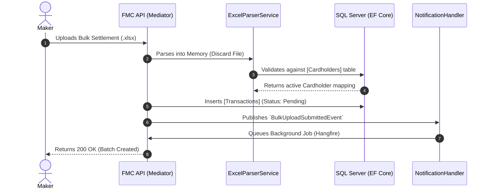
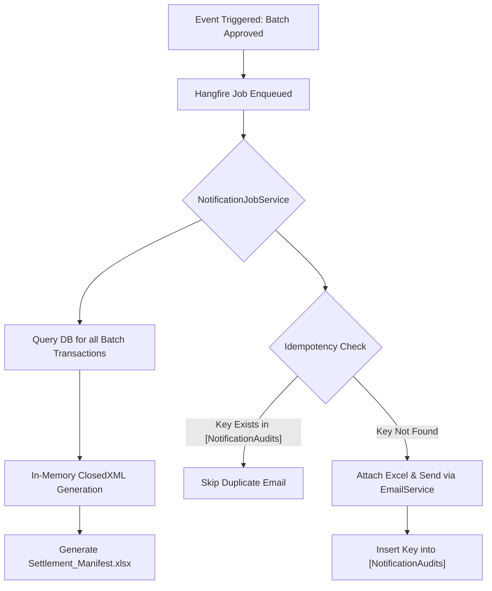
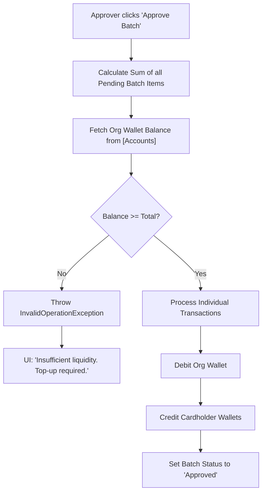
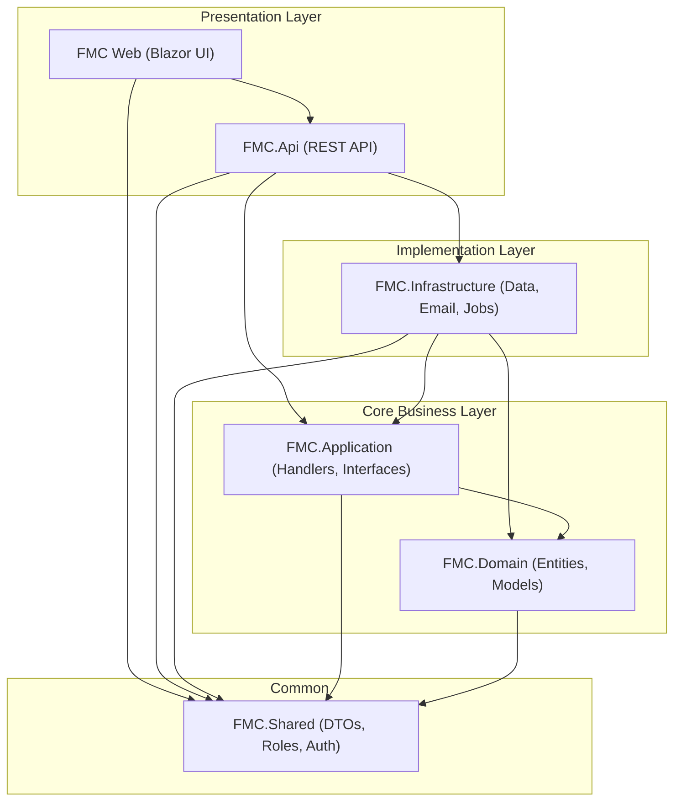

# Database Schema & Access Guide for Financial Transactions

This document is intended for the Data Integrity and Testing Engineering teams. It outlines the specific SQL Server tables, columns, and relationships accessed or modified during core financial workflows within the Finance Management Console (FMC).

## Executive Workflow Summary: The Two-Tier Liquidity Model
The FMC financial engine operates on a strict top-down liquidity flow:
1. **Institutional Funding (SuperAdmin ➡️ Subscriber)**: A `SuperAdmin` initiates a credit adjustment to an Organization's (Subscriber's) "Core Operations Wallet". This injects working capital into the tenant's ledger.
2. **Subscriber Dispersal (Subscriber ➡️ Cardholders)**: The Organization utilizes that funded capital to run payroll. Through the Maker-Checker bulk upload system, the organization submits a batch of transactions. Upon approval, the system atomically debits the Organization's wallet and credits the individual Cardholder wallets.

The following sections outline the exact database footprint required to verify the integrity of this ledger, explicitly separating **Existing Core Tables** (which the FMC must fetch/access) from **FMC Project Tables** (which are generated by this project).

## 1. Existing Core Tables (To Be Fetched / Accessed)
These tables pre-exist in the core system architecture. The FMC project requires access to fetch and read these records (and update ledgers) to facilitate the financial workflows.

### `[dbo].[Organizations]` (Read-Only)
Used to verify the existence and identity of the target subscriber.
*   **`Id`** `(uniqueidentifier)`: Primary Key. Matches the `TenantId` or `OrganizationId` in the Accounts table.
*   **`Name`** `(nvarchar)`: The subscriber's name.
*   **`WalletLimit`** `(decimal)`: Checked if capacity constraints are enforced.
*   **`IsDeleted`** `(bit)`: Checked to ensure the organization is active.

### `[dbo].[Accounts]` (Read/Write)
This table acts as the pre-existing unified ledger for both Organizations and Users. During SuperAdmin adjustments and Payroll approvals, an atomic lock is placed here.
*   **`Id`** `(uniqueidentifier)`: Primary Key.
*   **`TenantId`** `(nvarchar)`: For organizational wallets, this equals the `Organization.Id`. For user wallets, this equals the `ApplicationUser.Id`.
*   **`Balance`** `(decimal(18,2))`:**CRITICAL**. This is the actual fund value. Auditors must verify this value increments/decrements exactly by the expected amount.
*   **`RowVersion`** `(timestamp)`:**CRITICAL**. Used for Optimistic Concurrency Control. Engineers must observe this value changing after every successful `UPDATE`.

### `[dbo].[Cardholders]` (Read-Only)
Used to map the Excel spreadsheet rows to physical database users.
*   **`Id`** `(uniqueidentifier)`: Primary Key.
*   **`AccountNumber`** `(nvarchar)`: The physical card number (PAN) provided in the bulk upload file.
*   **`OrganizationId`** `(uniqueidentifier)`: Used to validate that the cardholder belongs to the subscriber initiating the payroll.
*   **`IdentityUserId`** `(nvarchar)`: Links the cardholder to their `AspNetUsers` login record and their `Account` (Wallet) via `TenantId`.
---

## 2. Identity & Account Mapping (Card Numbers)
In the FMC architecture, the **Primary Account Number (PAN)** serves double-duty. To simplify the database architecture and speed up transaction lookups for direct disbursement wallets, the physical 16-digit Card Number *is* the Account Number.

When a Maker uploads an Excel file with a "CardNumber" column, the backend maps this directly to `Cardholder.AccountNumber` to process the payroll.

### Entity Relationship Diagram

---

## 3. FMC Project Tables (Created by This Project)
These tables do not exist in the core banking architecture. They will be generated and maintained entirely within the scope of the Finance Management Console (FMC) project.

### `[dbo].[AspNetUsers]` (Write/Update)
The core identity store generated by the FMC's authentication framework (ASP.NET Core Identity). It manages all Makers, Approvers, and SuperAdmins.
*   **`Id`** `(nvarchar)`: Primary Key. Matches the `IdentityUserId` in Cardholders and `TenantId` in user-level Accounts.
*   **`OrganizationId`** `(uniqueidentifier)`: Links the user to their subscriber tenant.

### `[dbo].[Transactions]` (Write/Update)
Acts as the request queue and historical record of individual transfers.
*   **`Id`** `(uniqueidentifier)`: Primary Key.
*   **`Amount`** `(decimal(18,2))`:**CRITICAL**. The value to be transferred.
*   **`AccountId`** `(uniqueidentifier)`: The target wallet receiving the funds.
*   **`Status`** `(nvarchar)`: Progresses from `Pending` -> `Approved`.
*   **`MakerId`** `(nvarchar)`: The User ID who initiated the batch.
*   **`ApproverId`** `(nvarchar)`: The User ID who authorized the batch.
*   **`IdempotencyKey`** `(nvarchar)`:**CRITICAL**. A unique hash. Testing scenarios must include submitting the exact same payload twice to verify this column throws a unique constraint violation.
*   **`BatchId`** `(uniqueidentifier)`: Groups multiple transactions together for atomic settlement.
*   **`OrganizationId`** `(uniqueidentifier)`: The tenant context.

### Auxiliary Operational Tables (Write/Update)
The FMC project also generates the following tables to manage system health, security, and alerting:
*   **`[dbo].[AuditLogs]`**: Stores immutable records of user actions, login events, and administrative changes for compliance and security monitoring.
*   **`[dbo].[SystemAlerts]`**: Manages system-wide notifications and health alerts displayed directly on the FMC dashboard.
*   **`[dbo].[NotificationAudits]`**: Powers the idempotency engine for email and system notifications, ensuring duplicate alerts are not sent for the same background job.
*   **`[dbo].[UserOtpVerifications]`**: Handles the generation and validation of One-Time Passwords (OTP) for secure operations like logging in or confirming high-value batch settlements.
*   **`[dbo].[AspNetRoles]` & `[dbo].[AspNetUserRoles]`**: Identity tables that manage Role-Based Access Control (RBAC) (e.g., assigning users as `Maker`, `Approver`, or `SuperAdmin`).

---

## 4. Database Access Requirements
To fully execute end-to-end testing of financial integrity, the engineering team requires the following access levels to the `FMC_App` database (or staging equivalent):

| Table Name | `SELECT` | `UPDATE` | `DELETE` | Notes | Source |
| :--- | :---: | :---: | :---: | :--- | :--- |
| `[dbo].[Accounts]` | Yes | No | No | Read-only to verify ledger states. | Existing Core |
| `[dbo].[Organizations]` | Yes | No | No | Read-only to verify capacity limits. | Existing Core |
| `[dbo].[Cardholders]` | Yes | No | No | Read-only to map test data. | Existing Core |
| `[dbo].[AspNetUsers]` | Yes | *Yes* | *Yes* | Identity store managed by FMC framework. | **FMC Project** |
| `[dbo].[Transactions]` | Yes | *Yes* | *Yes* | Update/Delete required to teardown pending test batches. | **FMC Project** |
| `[dbo].[AuditLogs]` | Yes | *Yes* | *Yes* | Compliance and security tracking. | **FMC Project** |
| `[dbo].[SystemAlerts]` | Yes | *Yes* | *Yes* | Dashboard system health alerts. | **FMC Project** |
| `[dbo].[NotificationAudits]`| Yes | *Yes* | *Yes* | Idempotency tracking for jobs. | **FMC Project** |
| `[dbo].[UserOtpVerifications]`| Yes| *Yes* | *Yes* | Tracks generated 2FA/OTP codes. | **FMC Project** |

*Note: Direct UPDATE/DELETE access is intended strictly for pre-production environments to facilitate test data teardown.*

---

## 5. Core API & Backend Transaction Workflow
To help testing and engineering teams understand the system's runtime behavior, the following sequence illustrates how the FMC backend processes a Maker's bulk upload.

---

## 6. Email Notification & Idempotency Architecture
The FMC project features a robust asynchronous notification engine. Rather than blocking the API thread to generate complex Excel files and send emails, the system leverages **Hangfire** for background job processing.

### The Notification Lifecycle
When an Approver finalizes a batch (or a Maker submits one), the system needs to send an email to all Approvers and the CEO with a generated Excel manifest.

### Key Components
*   **Idempotency Engine**: Before any email is dispatched, the system queries the `[dbo].[NotificationAudits]` table using a unique hash (`Action:BatchId:RecipientEmail`). If a record exists, the job skips delivery to prevent spamming the CEO or Approvers in the event of a background worker retry/crash.
*   **Dynamic Excel Export**: Because the initial `.xlsx` file uploaded by the Maker is discarded instantly for security and memory reasons, the background job dynamically queries the `Transactions` table to regenerate the manifest on-the-fly and attaches it to the outbound SMTP email.

---

## 7. Liquidity Validation & Batch Atomicity
The FMC financial engine is designed with **Batch Atomicity** as a core principle. This ensures that a payroll batch is never "partially settled"—it either succeeds in full or fails in full if resources are unavailable.

### The "Pre-flight" Liquidity Check
When an Approver attempts to authorize a batch submitted by a Maker, the `OrganizationService` performs a critical pre-validation step before any individual ledger updates occur:

1.  **Aggregate Calculation**: The system sums the total `Amount` of all `Pending` transactions linked to the specific `BatchId`.
2.  **Wallet Inquiry**: The system queries the `[dbo].[Accounts]` table for the Organization's "Core Operations Wallet" (`TenantId = OrganizationId`).
3.  **Atomic Constraint**: 
    *   If `Organization Wallet Balance >= Total Batch Amount`: The system proceeds to loop through and settle each individual cardholder transaction.
    *   If `Organization Wallet Balance < Total Batch Amount`: The system throws an `InvalidOperationException` and halts the entire process.

### Error Handling & UX
When liquidity is insufficient, the process is aborted immediately. No funds are moved, and the batch remains in a `Pending` state. The Approver is notified with a clear error message:
> *Insufficient liquidity for full batch. Required: ₱XXX, Available: ₱YYY. Top-up the wallet to proceed.*

This prevents the system from entering a fragmented state where only half the staff receives payroll due to a mid-process balance exhaustion.

---

## 8. Project Architectural Structure
The Finance Management Console (FMC) is built following **Clean Architecture** principles, ensuring that business logic is isolated from external frameworks and database concerns.

### Project Dependencies & Layers
The system is divided into specialized projects, each with a clear responsibility:

### Layer Responsibilities
*   **FMC.Domain**: The "Heart" of the system. Contains the core financial entities (`Transaction`, `Account`, `Organization`) and base logic. It has zero external dependencies.
*   **FMC.Application**: Contains the "Use Cases" (e.g., `SubmitBulkTransaction`). It defines interfaces that the Infrastructure layer must implement.
*   **FMC.Infrastructure**: The "Muscle". Implements data persistence (EF Core), background processing (Hangfire), and external communications (SMTP/Email).
*   **FMC.Api**: The public gateway. Handles HTTP requests, authentication middleware, and maps incoming data to Application commands.
*   **FMC Web (Blazor)**: The administrative interface. A premium, reactive dashboard built with MudBlazor that consumes the API.
*   **FMC.Shared**: A lightweight project containing DTOs (Data Transfer Objects) and constants shared across both the client-side UI and the server-side API.
