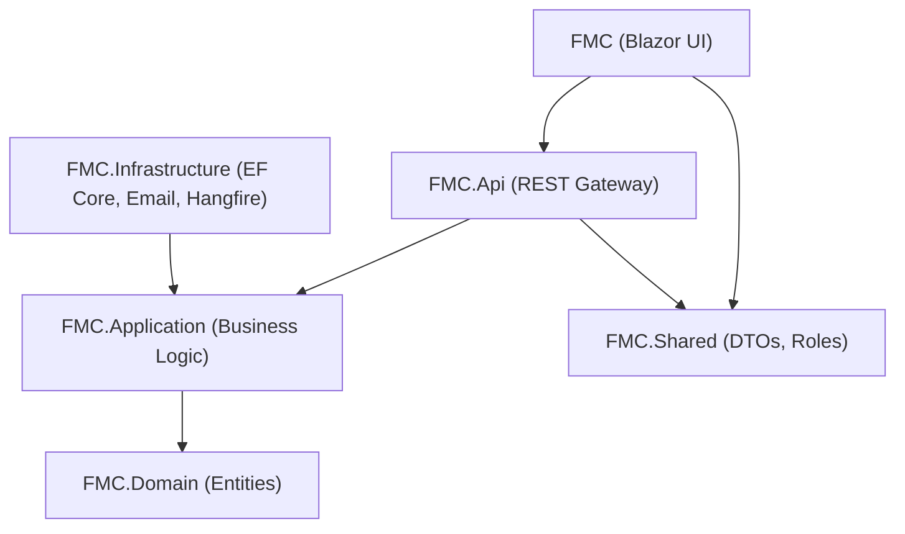

# Finance Management Console — Technical Architecture

**Version 3.1 | Last Updated: 2026-04-20**

This is the primary technical reference hub for engineers working on the FMC platform. It provides the high-level mapping of the system and links to specific architectural domain documents.

---

## 1. Solution Overview & Project Layers

FMC uses **Clean Architecture (Onion)** — dependencies flow strictly inward. The `Domain` layer has no dependencies; `Infrastructure` implements the `Application` contracts.

### Layer Responsibilities

| Project | Role | Key Contents |
| :--- | :--- | :--- |
| `FMC` | Blazor Server UI | Pages, Dashboards, `Services/Api/` HTTP bridge |
| `FMC.Api` | REST Gateway | Controllers, `Program.cs` DI & middleware configuration |
| `FMC.Application` | Business Contracts | Interfaces (`IOrganizationRepository`, `IBackgroundJobService`), MediatR Events |
| `FMC.Infrastructure` | Implementations | EF Core, Hangfire, Polly, Email, Repositories, BackgroundJobs |
| `FMC.Domain` | Core Entities | `Transaction`, `Organization`, `ApplicationUser`, `AuditLog`, `Account` |
| `FMC.Shared` | Portable Bridge | DTOs, `Auth/Roles.cs`, `FinanceUtils` |

---

## 2. Architectural Domains (Deep Dives)

The system is organized into the following specialized domains. Click an area to view its full architectural breakdown and diagrams:

*   🔒 **[Authentication, Session & Caching](authentication_session_architecture.md)**
    *   Hybrid JWT + HttpOnly Cookie Flows
    *   Silent Token Refresh Lifecycle
    *   Distributed Caching (OTP / Redis)

*   🛡️ **[RBAC & Multi-Tenancy](rbac_multi_tenancy_architecture.md)**
    *   Three-layer authorization logic
    *   EF Core Global Query Filters (Data Isolation)
    *   Role Permission Matrix

*   ⚖️ **[Financial Workflow (Maker-Checker)](financial_workflow_architecture.md)**
    *   Four-Eyes Principle enforcement
    *   Transaction State diagrams
    *   Ledger adjustment lifecycle

*   💎 **[Ledger Integrity & Hardening](ledger_integrity_hardening.md)**
    *   Optimistic Concurrency Control (OCC)
    *   End-to-End Idempotency Guards
    *   Atomic Database Transactions
    *   Nightly Ledger Reconciliation

*   ⚡ **[Background Job System (Hangfire)](background_job_architecture.md)**
    *   Async email and alert queues
    *   Job retry logic and dashboarding
    *   SQL Server persisted workers

*   🚀 **[Resilience & Performance](resilience_performance_architecture.md)**
    *   Two-layer fault tolerance (Polly + EF Retries)
    *   Batched $O(1)$ database query optimization
    *   Circuit breakers and database indexes

*   🔍 **[Security, Audit & User Lifecycle](security_audit_lifecycle.md)**
    *   Immutable forensic logging
    *   Closed-loop institutional user provisioning
    *   Rate-limited password recovery workflows

---

## 3. Development Quick-Reference

Use this matrix to determine **where** to write your code:

| Goal | Target Folder / File |
| :--- | :--- |
| Expose a new API endpoint | `FMC.Api/Controllers/` |
| Add a core business rule | `FMC.Infrastructure/Services/OrganizationService.cs` |
| Optimize a database query | `FMC.Infrastructure/Repositories/OrganizationRepository.cs` |
| Add a background task | `FMC.Infrastructure/BackgroundJobs/NotificationJobService.cs` |
| Configure retry logic | `FMC.Infrastructure/Resilience/ResiliencePolicies.cs` |
| Add a database column | `FMC.Domain/Entities/` (Then run EF migration) |
| Standardize payload data | `FMC.Shared/DTOs/` |
| Build an admin dashboard | `FMC/Components/Pages/Admin/` |

---

> **Note on Roadmap**: For upcoming feature planning and phase delivery, refer to the [Project Roadmap](../project_roadmap.md).
