# Finance Management Console — Technical Architecture

**Version 3.0 | Last Updated: 2026-04-20**

This is the primary technical reference for engineers working on the FMC platform. It is organized into self-contained architectural domains. Each section documents **what** the system does, **why** it is designed that way, and **where** to make changes.

---

## Table of Contents

1. [Solution Overview & Project Structure](#1-solution-overview--project-structure)
2. [Authentication & Session Architecture](#2-authentication--session-architecture)
3. [Role-Based Access Control (RBAC)](#3-role-based-access-control-rbac)
4. [Multi-Tenancy & Data Isolation](#4-multi-tenancy--data-isolation)
5. [Financial Workflow (Maker-Checker)](#5-financial-workflow-maker-checker)
6. [Background Job System (Hangfire)](#6-background-job-system-hangfire)
7. [Resilience & Performance Architecture](#7-resilience--performance-architecture)
8. [Security, Caching & Audit](#8-security-caching--audit)
9. [User Lifecycle & Recovery](#9-user-lifecycle--recovery)
10. [Development Quick-Reference](#10-development-quick-reference)

---

## 1. Solution Overview & Project Structure

FMC uses **Clean Architecture (Onion)** — dependencies flow strictly inward. The `Domain` layer has no dependencies; `Infrastructure` implements the `Application` contracts.

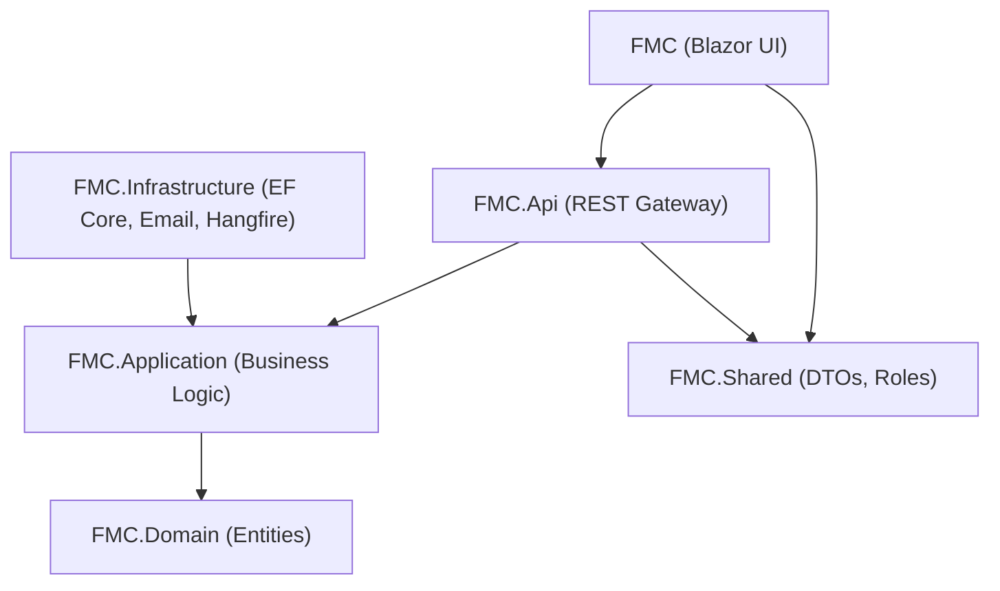

### Layer Responsibilities

| Project | Role | Key Contents |
| :--- | :--- | :--- |
| `FMC` | Blazor Server UI | Pages, Dashboards, `Services/Api/` HTTP bridge |
| `FMC.Api` | REST Gateway | Controllers, `Program.cs` DI & middleware configuration |
| `FMC.Application` | Business Contracts | Interfaces (`IOrganizationRepository`, `IBackgroundJobService`), MediatR Events |
| `FMC.Infrastructure` | Implementations | EF Core, Hangfire, Polly, Email, Repositories, BackgroundJobs |
| `FMC.Domain` | Core Entities | `Transaction`, `Organization`, `ApplicationUser`, `AuditLog`, `Account` |
| `FMC.Shared` | Portable Bridge | DTOs, `Auth/Roles.cs`, `FinanceUtils` |

### Where to Make Changes

| Task | File Location |
| :--- | :--- |
| New API endpoint | `FMC.Api/Controllers/` |
| New business rule | `FMC.Infrastructure/Services/OrganizationService.cs` |
| New database query | `FMC.Infrastructure/Repositories/OrganizationRepository.cs` |
| New background job | `FMC.Infrastructure/BackgroundJobs/NotificationJobService.cs` |
| New resilience policy | `FMC.Infrastructure/Resilience/ResiliencePolicies.cs` |
| New database column | `FMC.Domain/Entities/` → then run EF migration |
| New shared DTO | `FMC.Shared/DTOs/` |
| UI page or dashboard | `FMC/Components/Pages/` or `FMC/Components/Dashboard/` |

---

## 2. Authentication & Session Architecture

FMC uses a **Hybrid JWT + HttpOnly Cookie** strategy. Short-lived JWTs carry identity claims per-request; a long-lived HttpOnly refresh token cookie silently renews sessions.

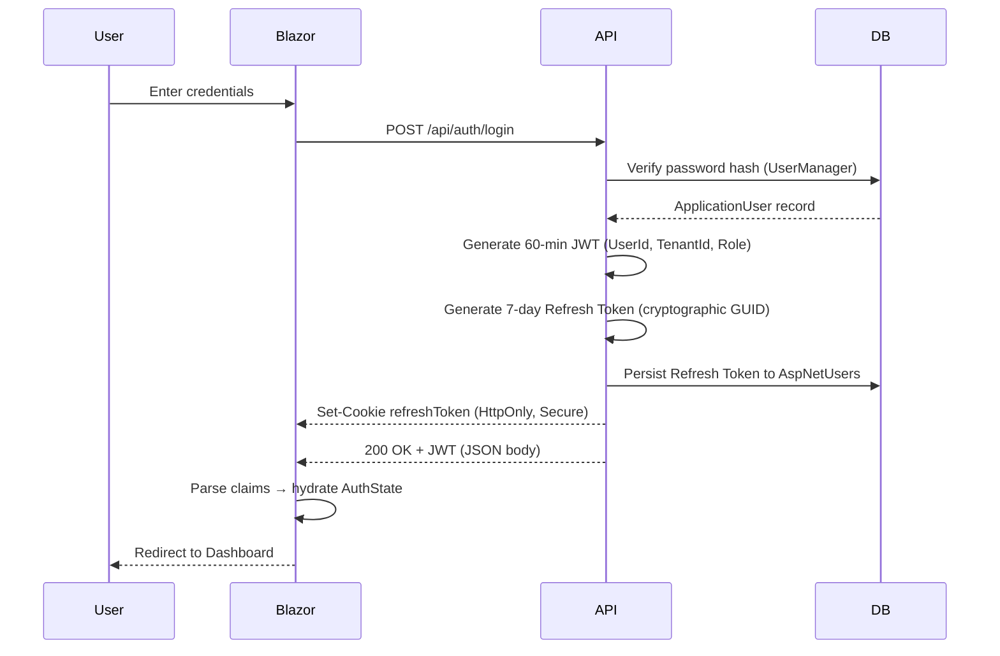

### Silent Refresh Lifecycle

When a JWT expires mid-session, the `AuthenticationHeaderHandler` interceptor handles renewal transparently:

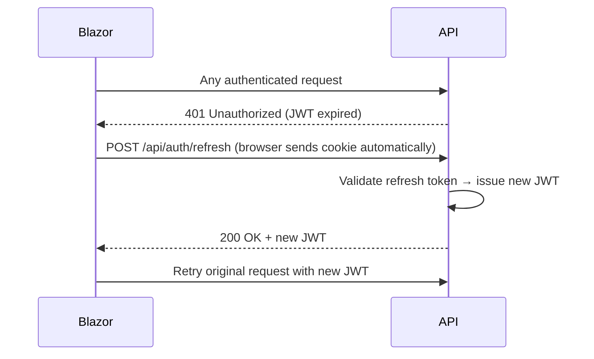

### Security Pillars

| Token | Storage | Lifespan | Purpose |
| :--- | :--- | :--- | :--- |
| **JWT** | App memory | 60 min | Bearer authentication on every API call |
| **Refresh Token** | HttpOnly Cookie | 7 days | Silent session renewal — invisible to JavaScript |

**Hardening Measures:**
- XSS: Tokens never stored in `localStorage`
- CSRF: `SameSite=Lax` cookie policy
- Brute Force: Identity lockout after 5 failed attempts (5-minute lockout)
- Audit: Every login success/failure recorded to `AuditLog` with IP + User-Agent

---

## 3. Role-Based Access Control (RBAC)

Authorization is enforced at three independent layers. Bypassing one does not grant access — all three must pass.

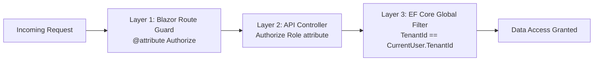

### Role Hierarchy & Permissions

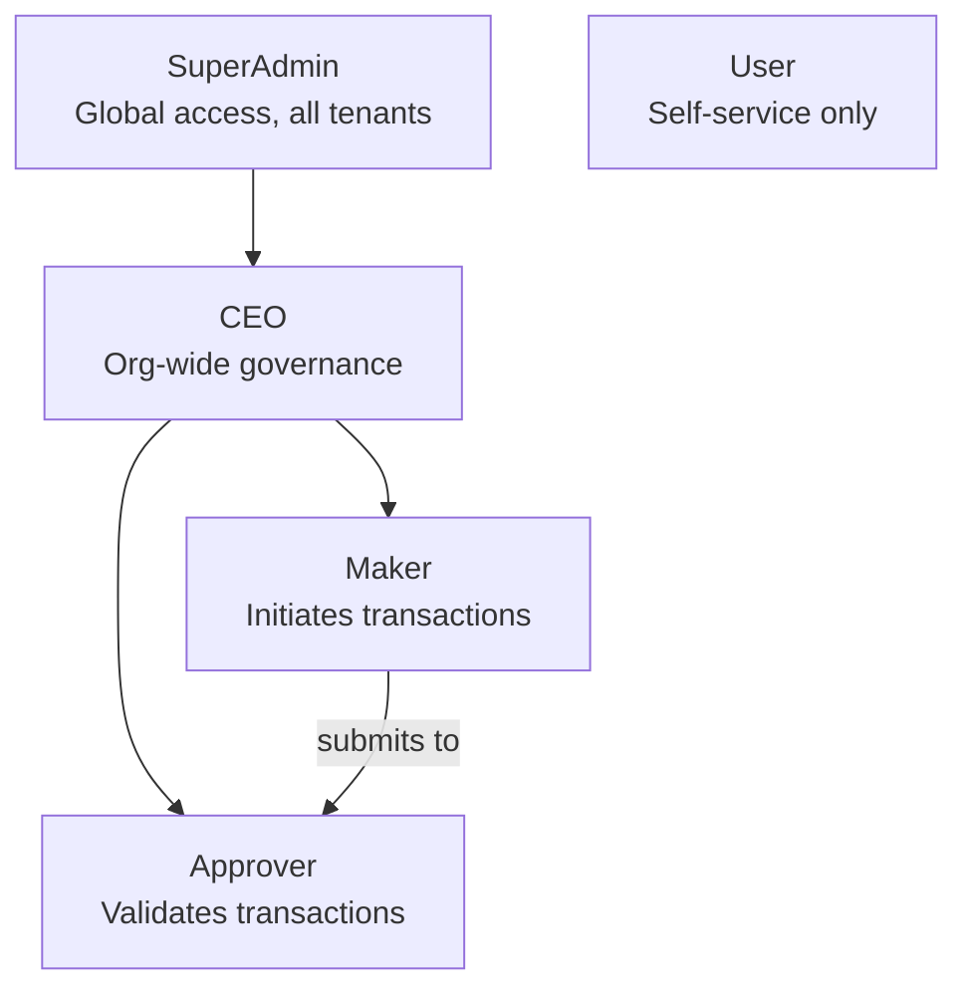

### Permission Matrix

| Capability | SuperAdmin | CEO | Maker | Approver | User |
| :--- | :---: | :---: | :---: | :---: | :---: |
| Fund Organization Wallet | ✅ | ❌ | ❌ | ❌ | ❌ |
| Create Users | ✅ | ✅ | ❌ | ❌ | ❌ |
| Initiate Transaction | ❌ | ❌ | ✅ | ❌ | ❌ |
| Approve / Reject Transaction | ❌ | ❌ | ❌ | ✅ | ❌ |
| View Audit Logs | ✅ | ✅ | ❌ | ❌ | ❌ |
| View Own Profile | ✅ | ✅ | ✅ | ✅ | ✅ |

> [!CAUTION]
> **Four-Eyes Enforcement**: A Maker **cannot** approve their own transaction. The service layer compares `transaction.MakerId == approverId` and throws if they match.

> [!IMPORTANT]
> **Role Sync**: When a role changes, the user must re-authenticate (next login or token refresh) for the new claims to take effect in the browser.

---

## 4. Multi-Tenancy & Data Isolation

Every row in the database that belongs to a tenant is silently filtered by **Global Query Filters** in `ApplicationDbContext`. A user can never query another organization's data, even with a direct SQL-equivalent LINQ statement.

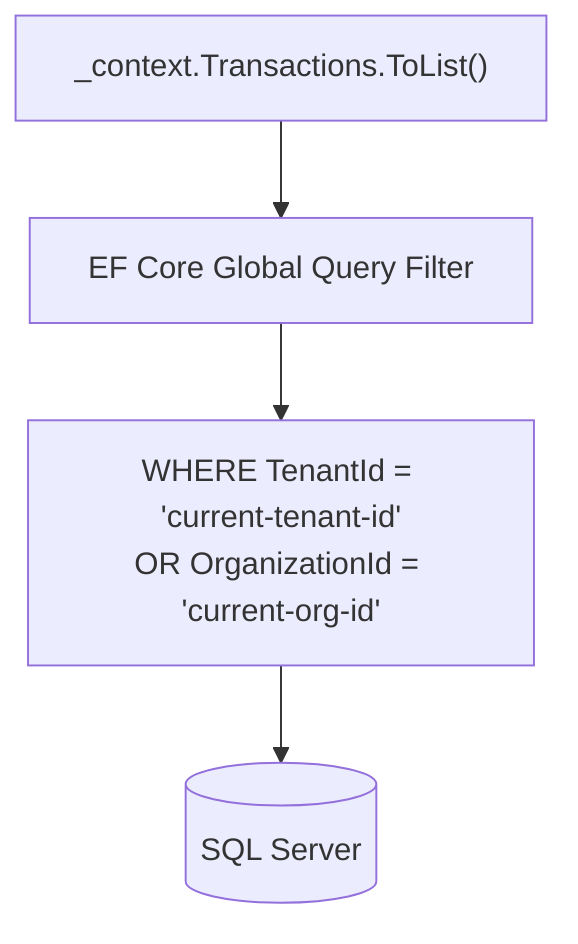

### Tenant Context Resolution

`CurrentUserService` is the single source of truth for the active user's identity within a request:

```csharp
// Reads from JWT claims on every request — zero DB round-trips
public string? TenantId        => _httpContext.User.FindFirst("TenantId")?.Value;
public Guid?   OrganizationId  => ...parsed from claims...
public bool    IsSuperAdmin    => _httpContext.User.IsInRole(Roles.SuperAdmin);
```

`IsSuperAdmin` bypasses the tenant filter entirely, granting global visibility — used for system administration only.

---

## 5. Financial Workflow (Maker-Checker)

FMC enforces a strict **Four-Eyes Principle** for all financial movements. No single user can both initiate and settle a transaction.

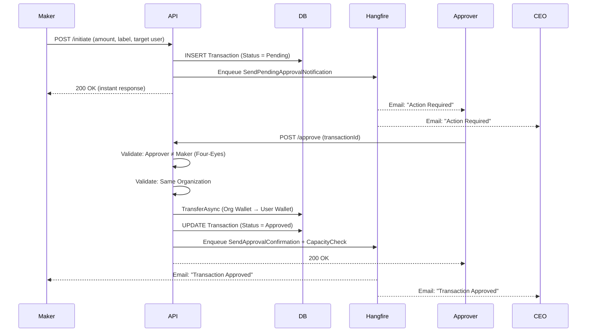

### Transaction States

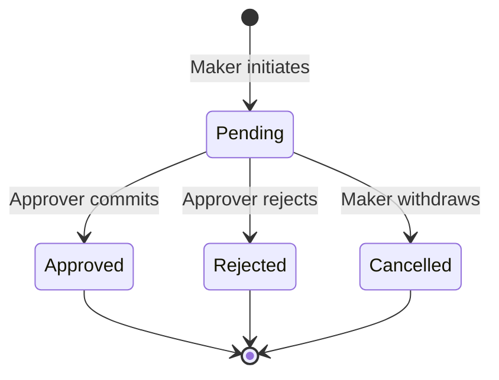

---

## 6. Background Job System (Hangfire)

All long-running operations (emails, capacity checks) are processed asynchronously via **Hangfire**, using your company's existing SQL Server as the job store — no additional infrastructure required.

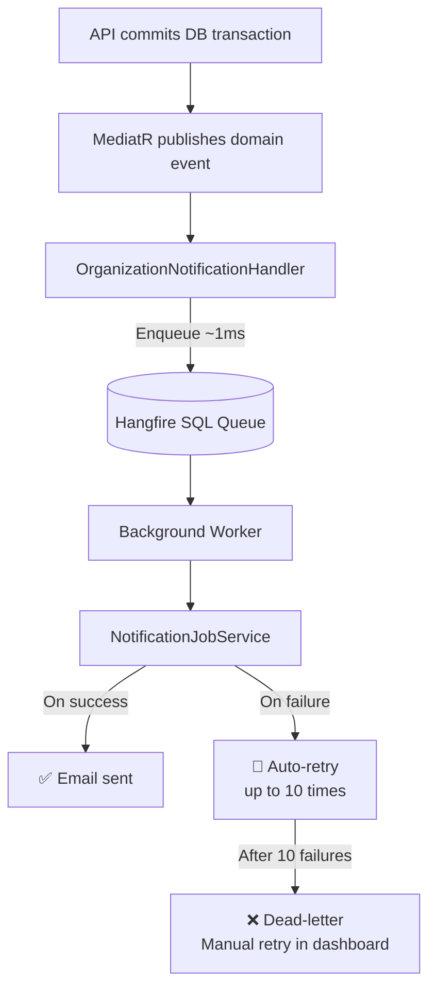

### Job Types

| Job Method | Trigger | Recipients |
| :--- | :--- | :--- |
| `SendPendingApprovalNotificationAsync` | Maker initiates | All Approvers + CEO |
| `SendApprovalConfirmationAsync` | Approver approves | Maker + CEO |
| `SendWalletAdjustmentNotificationAsync` | SuperAdmin funds wallet | CEO |

### Key Design Rules
- Job parameters must be **primitive types only** (`Guid`, `string`, `decimal`) — Hangfire serializes them to SQL JSON. Complex objects create stale snapshots.
- Each job method is **independently atomic** — a failed approval email does not affect capacity alerts.
- Jobs persist across server restarts — no emails are "lost" during deployments.

**Hangfire Dashboard**: `https://[api-host]/hangfire` — view all job history, retry failed jobs, monitor workers.

> [!IMPORTANT]
> Before publishing, secure the Hangfire dashboard by replacing `LocalRequestsOnlyAuthorizationFilter` with a policy requiring the `SuperAdmin` role.

---

## 7. Resilience & Performance Architecture

### Two-Layer Database Resilience

Every database operation is protected by two independent fault-tolerance layers:

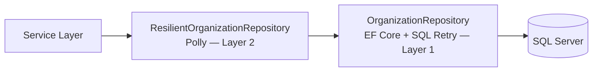

| Layer | Technology | Handles | Retry Count |
| :--- | :--- | :--- | :--- |
| **Layer 1** | EF Core `EnableRetryOnFailure` | Known SQL transient error codes | 5 retries, max 10s delay |
| **Layer 2** | Polly `ResiliencePipeline` | `SqlException`, `TimeoutException`, `TaskCanceledException` | 3 retries, exponential back-off (2s→4s→8s) |

### Batched Query Optimization

The original `GetAllAsync` caused **O(N) database round-trips** — 100 organizations = 300+ queries. The refactored `GetAllWithStatsAsync` fetches all data in **5 fixed queries**, regardless of organization count:

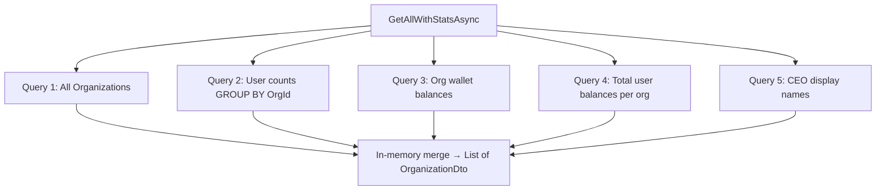

**Result**: ~98% reduction in database round-trips on the Organization list page.

### Performance Indexes

Added to `ApplicationDbContext.OnModelCreating` to ensure ledger queries use index seeks:

```csharp
builder.Entity<Transaction>().HasIndex(t => t.OrganizationId);
builder.Entity<Transaction>().HasIndex(t => t.Date);
builder.Entity<Transaction>().HasIndex(t => t.Status);
```

### Circuit Breaker (Future External API)

`ResiliencePolicies.GetExternalServiceCircuitBreaker()` is pre-built for when the company Cardholder server is connected:
- Trips if 50%+ of calls fail within 30 seconds (minimum 5 samples)
- Breaks for 60 seconds (fast-fail, no hanging requests)
- Logs state transitions: Opened → Half-Open → Closed

---

## 8. Security, Caching & Audit

### Distributed Cache

FMC uses `IDistributedCache` — a swap-safe abstraction. The provider differs by environment:

| Environment | Provider | Cost |
| :--- | :--- | :--- |
| Development | `AddDistributedMemoryCache` | Free (in-process RAM) |
| Production | SQL Server or Self-Hosted Redis | Free (company servers) |

**Current Cache Keys:**

| Key Pattern | TTL | Data |
| :--- | :--- | :--- |
| `reg_otp_{email}` | 10 min | Registration OTP |
| `fp_otp_{userId}` | 10 min | Password reset OTP |
| `pwd_otp_{userId}` | 10 min | Password change OTP |

> [!NOTE]
> No PII or plaintext passwords are stored in the cache. Keys use hashed identifiers to prevent cross-tenant collisions.

### Audit Log Architecture

Every sensitive system event is written to `AuditLog` via `AuditService`. The table is **append-only** — no Update or Delete methods exist on `AuditService`.

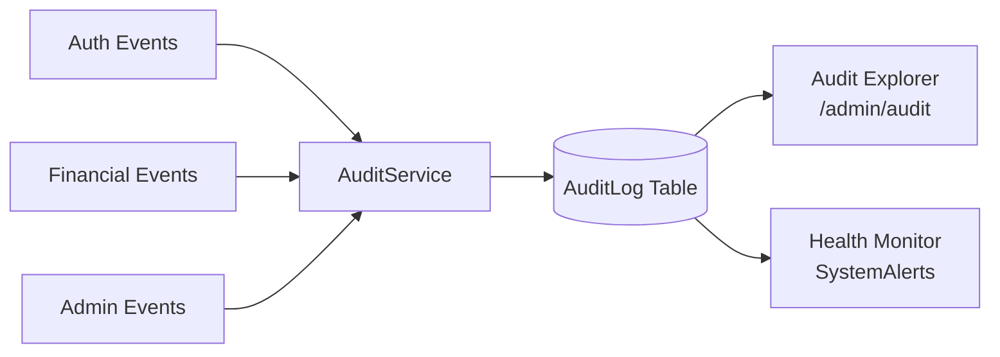

### Audit Event Taxonomy

| Event | Risk Level | Trigger |
| :--- | :---: | :--- |
| `Login Success` | Low | Valid credentials presented |
| `Login Failed` | High | Invalid credentials (IP + UserAgent captured) |
| `Logout` | Low | Session explicitly terminated |
| `Password Reset` | Medium | OTP-based recovery completed |
| `User Created` | Medium | Admin provisions new account |
| `WALLET_FUNDED` | High | SuperAdmin credits org wallet |
| `TRANSACTION_APPROVED` | High | Approver settles a Maker request |
| `APPROVAL_BLOCKED` | Critical | Four-Eyes or cross-org violation attempt |

> [!WARNING]
> **Immutability**: The AuditLog table has no update or delete pathway. Records are forensic evidence and must be treated as permanent.

---

## 9. User Lifecycle & Recovery

### User Provisioning

FMC uses **closed-loop provisioning** — no public registration. All accounts are created by a CEO or SuperAdmin.

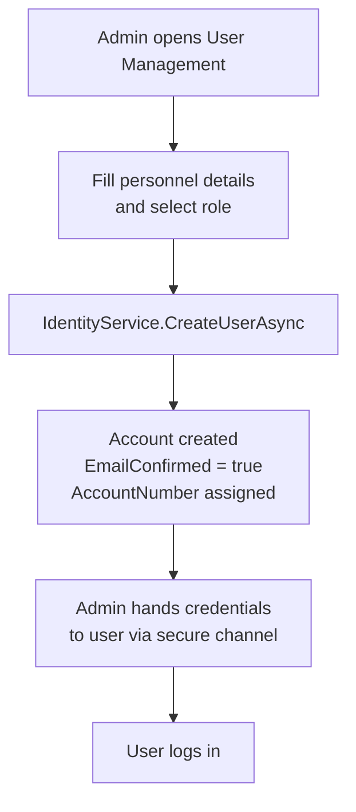

### Password Recovery (Forgot Password)

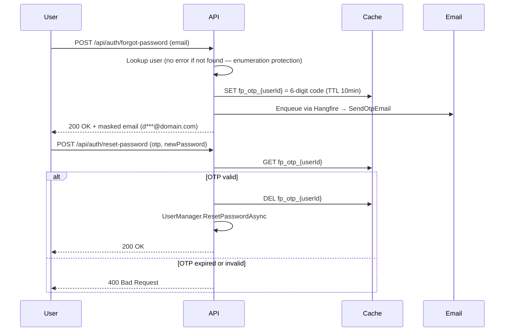

**Rate-Limiting**: A 60-second cooldown timer is enforced in the UI on the "Resend Code" button to prevent email flooding.

---

## 10. Development Quick-Reference

### Adding a New Notification Email
1. Add a template method to `IEmailTemplateService` and implement it in `EmailTemplateService.cs`
2. Add a job method to `NotificationJobService.cs`
3. Enqueue from any event handler: `_jobService.Enqueue<NotificationJobService>(j => j.YourNewJob(...))`

### Adding a New Repository Method
1. Declare the signature in `IOrganizationRepository.cs`
2. Implement in `OrganizationRepository.cs`
3. Add the passthrough delegate in `ResilientOrganizationRepository.cs`

### Adding a Recurring Job (e.g. Nightly Report)
```csharp
_jobService.AddOrUpdateRecurring<YourJobClass>(
    "fmc-nightly-ledger",
    job => job.RunNightlyLedgerAsync(),
    Cron.Daily(hour: 0));  // Midnight UTC
```

### Connecting the Cardholder Server (Future)
1. Create `ICardholderRepository` in `FMC.Application/Interfaces/`
2. Implement `CardholderRepository` using the external connection string
3. Create `ResilientCardholderRepository` using `ResiliencePolicies.GetExternalServiceCircuitBreaker()`
4. Register both in `Program.cs`
5. Service layer calls both repos separately — merge results in memory (never SQL JOIN across servers)
