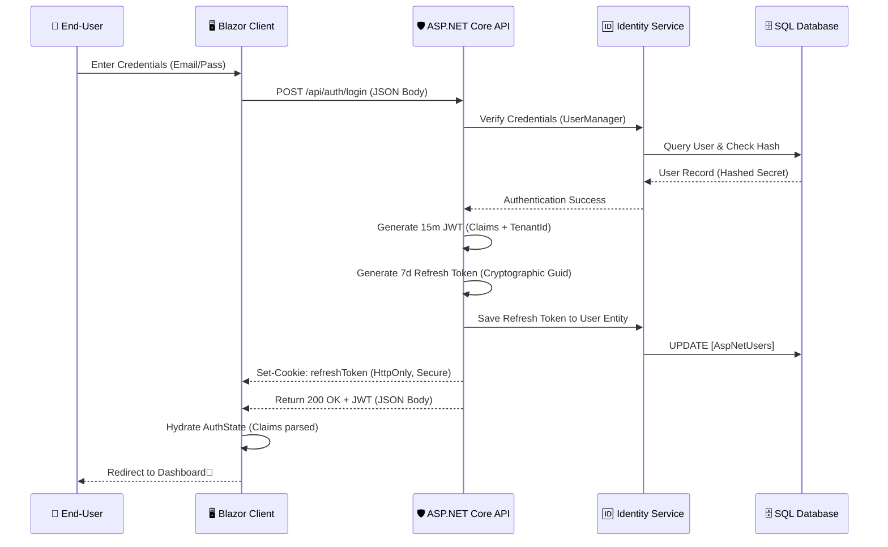

# Authentication & Session Architecture (Atomic Level)

## 1. Executive Summary
FMC utilizes a **Hybrid Token/Cookie Authentication** strategy designed for maximum security and seamless user experience. This architecture isolates sensitive long-lived session data (Refresh Tokens) in secure browser silos while utilizing transient tokens (JWT) for high-performance API communication.

---

## 2. Authentication Sequence Diagram
The following diagram illustrates the "Atomic Flow" of a user login from the interactive Blazor UI through the RESTful security boundary.

---

## 3. The Security Pillars

### **Pillar A: JWT (Access Token - The Key)**
- **Transport**: Stored in **System Memory** or local `ApplicationState`.
- **Lifespan**: **15 Minutes**.
- **Role**: Present in the `Authorization: Bearer <TOKEN>` header for every financial API call.
- **Security**: Contains the `TenantId` and `UserId` as immutable claims, preventing "Horizontal Privilege Escalation."

### **Pillar B: Refresh Token (The Vault)**
- **Transport**: **HttpOnly, Secure, SameSite=Strict Cookie**.
- **Lifespan**: **7 Days**.
- **Role**: Used exclusively to renew an expired JWT without re-prompting the user for credentials.
- **Security**: Because it is `HttpOnly`, it is **invisible** to JavaScript (XSS Protection). The browser automatically includes it in the `POST /api/auth/refresh` request.

### **Pillar C: Multi-Tenancy Enforcement**
Unlike basic applications, every authentication flow in FMC is "Tenant-Aware."
1. The **JWT** is stamped with the user's `TenantId`.
2. On every request, the API's `CurrentUserService` extracts this ID.
3. The `ApplicationDbContext` uses a **Global Query Filter** to ensure that SQL commands like `SELECT * FROM Transactions` effectively become `SELECT * FROM Transactions WHERE TenantId = 'USER_TENANT'`.

---

## 4. The "Silent Refresh" Lifecycle
To prevent session expiration during active usage, the system follows this automated logic:
1. **Request Interception**: All `HttpClient` calls in the Blazor UI are piped through a custom interceptor.
2. **401 Detection**: If an API call returns `401 Unauthorized` (expired JWT), the interceptor pauses the request.
3. **Renewal**: The client calls `api/auth/refresh`. The browser sends the `refreshToken` cookie.
4. **Succession**: The API returns a fresh JWT. The interceptor retries the original failed request with the new key.
5. **Seamlessness**: The user never sees a loading screen or a login prompt.

---

## 5. Forensic Accountability (Audit Logs)
Every "Atomic Event" in the lifecycle is written to the `AuditLog` table:
- **Event: Login**: Captures Success/Failure + Browser User Agent + Source IP.
- **Event: Logout**: Captures the exact moment the refresh token was invalidated.
- **Forensic Marker**: Even failed login attempts (where no user exists) are logged under a `SYSTEM` tenant to identify brute-force patterns.

---

## 6. Hardening Measures
- **XSS Mitigation**: Sensitive tokens are never stored in `localStorage`.
- **CSRF Mitigation**: `SameSite=Strict` cookie policy prevents cross-origin session hijacking.
- **Brute Force Protection**: Managed via Identity Framework Lockout policies (Locked after 5 failed attempts).
- **Physical Heuristics**: Real-time Caps Lock monitoring to prevent UI-level credential leakage / frustration.
