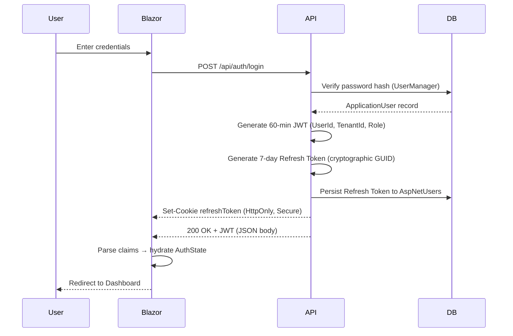
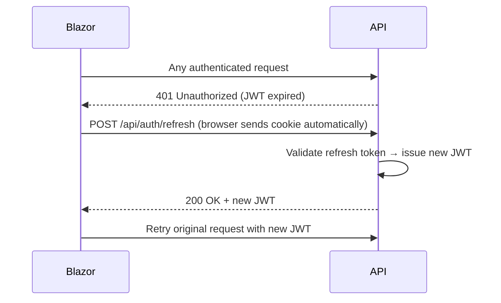

# Authentication, Session & Caching Architecture

## 1. Authentication & Session Architecture

FMC uses a **Hybrid JWT + HttpOnly Cookie** strategy. Short-lived JWTs carry identity claims per-request; a long-lived HttpOnly refresh token cookie silently renews sessions.

### Silent Refresh Lifecycle

When a JWT expires mid-session, the `AuthenticationHeaderHandler` interceptor handles renewal transparently:

### Security Pillars

| Token | Storage | Lifespan | Purpose |
| :--- | :--- | :--- | :--- |
| **JWT** | App memory | 60 min | Bearer authentication on every API call |
| **Refresh Token** | HttpOnly Cookie | 7 days | Silent session renewal — invisible to JavaScript |

**Hardening Measures:**
- XSS: Tokens never stored in `localStorage`
- CSRF: `SameSite=Lax` cookie policy
- Brute Force: Identity lockout after 5 failed attempts (5-minute lockout)
- Audit: Every login success/failure recorded to `AuditLog` with IP + User-Agent

---

## 2. Distributed Caching

FMC uses `IDistributedCache` — a swap-safe abstraction. The provider differs by environment:

| Environment | Provider | Cost |
| :--- | :--- | :--- |
| Development | `AddDistributedMemoryCache` | Free (in-process RAM) |
| Production | SQL Server or Self-Hosted Redis | Free (company servers) |

**Current Cache Keys:**

| Key Pattern | TTL | Data |
| :--- | :--- | :--- |
| `reg_otp_{email}` | 10 min | Registration OTP |
| `fp_otp_{userId}` | 10 min | Password reset OTP |
| `pwd_otp_{userId}` | 10 min | Password change OTP |

> [!NOTE]
> No PII or plaintext passwords are stored in the cache. Keys use hashed identifiers to prevent cross-tenant collisions.
