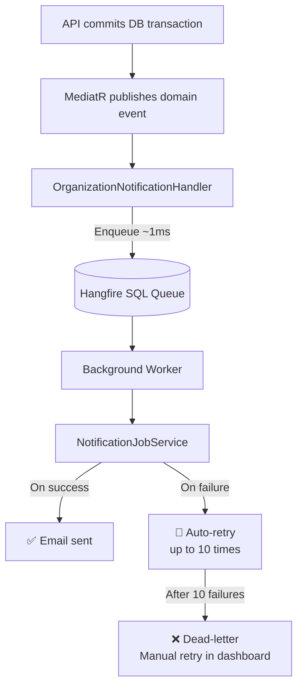

# Background Job System (Hangfire)

All long-running operations (emails, capacity checks) are processed asynchronously via **Hangfire**, using your company's existing SQL Server as the job store — no additional infrastructure required.

### Job Types

| Job Method | Trigger | Recipients |
| :--- | :--- | :--- |
| `SendPendingApprovalNotificationAsync` | Maker initiates | All Approvers + CEO |
| `SendApprovalConfirmationAsync` | Approver approves | Maker + CEO |
| `SendWalletAdjustmentNotificationAsync` | SuperAdmin funds wallet | CEO |

### Key Design Rules
- Job parameters must be **primitive types only** (`Guid`, `string`, `decimal`) — Hangfire serializes them to SQL JSON. Complex objects create stale snapshots.
- Each job method is **independently atomic** — a failed approval email does not affect capacity alerts.
- Jobs persist across server restarts — no emails are "lost" during deployments.

**Hangfire Dashboard**: `https://[api-host]/hangfire` — view all job history, retry failed jobs, monitor workers.

> [!IMPORTANT]
> Before publishing, secure the Hangfire dashboard by replacing `LocalRequestsOnlyAuthorizationFilter` with a policy requiring the `SuperAdmin` role.
