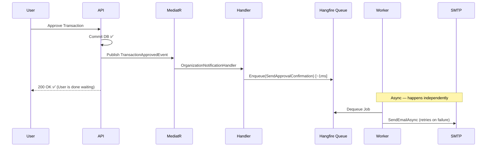

# ⚡ Background Job Architecture (Hangfire)

This document describes the **asynchronous task processing system** in the Finance Management Console. The system uses **Hangfire** backed by your company's existing SQL Server to decouple long-running operations (email delivery) from the user-facing API response cycle.

> **Last Updated**: 2026-04-20

---

## 1. Why Background Jobs?

Without background jobs, a user clicking "Fund Organization" would wait for:
1. Database transaction to commit ✅
2. Email to render ⏳
3. SMTP server to accept the message ⏳
4. All Approvers + CEO emails to send ⏳

**With Hangfire**, the user gets a response after step 1 only (~50ms). The remaining steps happen silently in the background.

---

## 2. Architecture: Fire-and-Forget via Queue



---

## 3. Components

### `IBackgroundJobService` (Application Layer)
```
FMC.Application/Interfaces/IBackgroundJobService.cs
```
A clean abstraction so business code never imports `Hangfire` directly. If Hangfire is ever replaced with Azure Service Bus or Quartz.NET, only `HangfireBackgroundJobService.cs` changes — no other code.

**Methods:**
- `Enqueue<T>()` — Fire-and-forget, runs as soon as a worker is free
- `Schedule<T>()` — Delayed job (e.g., "send reminder in 30 minutes")
- `AddOrUpdateRecurring<T>()` — CRON-based recurring job (e.g., "nightly ledger summary")

---

### `HangfireBackgroundJobService` (Infrastructure Layer)
```
FMC.Infrastructure/BackgroundJobs/HangfireBackgroundJobService.cs
```
Hangfire-backed implementation of `IBackgroundJobService`. Jobs are serialized as JSON and stored in dedicated Hangfire tables in your SQL Server database.

---

### `NotificationJobService` (Infrastructure Layer)
```
FMC.Infrastructure/BackgroundJobs/NotificationJobService.cs
```
The typed job class. Each method is a discrete, independently atomic background job.

> **Design Rule**: Job parameters must be **primitive types only** (`Guid`, `string`, `decimal`). Never pass complex objects — Hangfire must serialize them to SQL JSON, and complex objects create brittle snapshots of state.

| Method | Trigger | Recipients |
| :--- | :--- | :--- |
| `SendPendingApprovalNotificationAsync` | Maker submits transaction | All Approvers + CEO |
| `SendApprovalConfirmationAsync` | Approver approves transaction | Maker + CEO + Capacity check |
| `SendWalletAdjustmentNotificationAsync` | SuperAdmin funds org wallet | CEO |

---

### `OrganizationNotificationHandler` (Refactored)
```
FMC.Infrastructure/Services/OrganizationNotificationHandler.cs
```
MediatR event handler. Previously sent emails inline (blocking). Now calls `IBackgroundJobService.Enqueue()` and returns `Task.CompletedTask` in under 1ms.

---

## 4. Infrastructure Configuration

### SQL Server Storage (Zero Extra Cost)
Configured in `FMC.Api/Program.cs`:
```csharp
builder.Services.AddHangfire(config => config
    .UseSqlServerStorage(connectionString, new SqlServerStorageOptions
    {
        QueuePollInterval  = TimeSpan.Zero, // Immediate dequeue
        DisableGlobalLocks = true           // Better multi-server support
    }));

builder.Services.AddHangfireServer(options =>
{
    options.WorkerCount = 2;              // Increase as email volume grows
    options.ServerName  = "FMC-BackgroundWorker";
    options.Queues      = new[] { "critical", "default", "low" };
});
```

### SQL Tables Created Automatically
On first run, Hangfire creates its own schema in your database:
- `HangFire.Job` — persisted job definitions
- `HangFire.Queue` — job dispatch queue
- `HangFire.State` — job state history (Enqueued → Processing → Succeeded/Failed)

---

## 5. Monitoring — Hangfire Dashboard

Access at: `https://[your-api-host]/hangfire`

Provides real-time visibility into:
- ✅ Succeeded jobs (with full execution logs)
- ❌ Failed jobs (with stack traces and retry schedule)
- ⏳ Enqueued jobs awaiting a worker
- 🔄 Recurring job schedule

> **Security Note**: The dashboard is currently restricted to local requests only (`LocalRequestsOnlyAuthorizationFilter`). Before publishing, replace with a policy that requires the `SuperAdmin` role.

---

## 6. Failure & Retry Behaviour

| Attempt | Delay Before Retry |
| :---: | :--- |
| 1 | Immediate |
| 2 | ~10 seconds |
| 3 | ~1 minute |
| 4 | ~5 minutes |
| 5–10 | Increasing exponentially up to ~1 day |

After 10 failures the job is moved to **"Failed"** state in the dashboard, where it can be **manually retried** with a single click once the root cause is resolved (e.g., SMTP server restored).

---

## 7. Scalability Path

| Scenario | Action |
| :--- | :--- |
| Email volume doubles | Increase `WorkerCount` from 2 to 4 in `Program.cs` |
| Need priority queues | Use `[Queue("critical")]` attribute on job methods |
| Need a report generation job | Add a method to `NotificationJobService` and enqueue via `IBackgroundJobService` |
| Need nightly ledger summaries | Call `AddOrUpdateRecurring<T>("fmc-nightly", job => ..., Cron.Daily())` |
