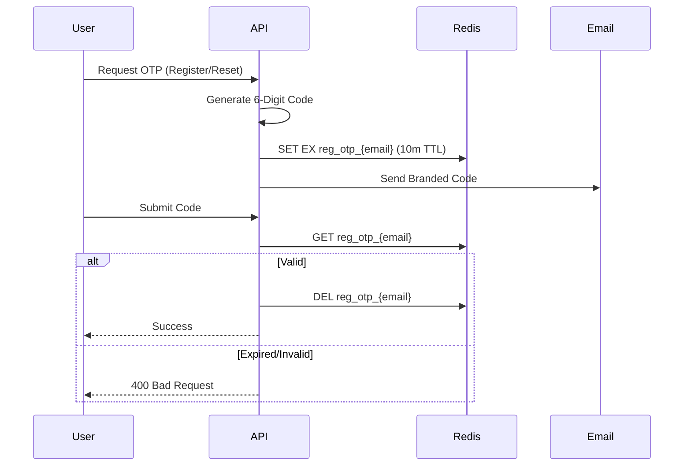

# Distributed Caching Architecture

This document outlines the **Infrastructure Caching Strategy** of the Finance Management Console (FMC). By leveraging Redis, the system achieves high-performance state management and secure authentication flows.

---

## 1. Architectural Strategy

FMC uses a **Hybrid Caching Model** to ensure resilience across different environments.

```mermaid
graph LR
    LB[Load Balancer] --> App[FMC API Nodes]
    App -->|(1) Hit Cache| Redis[(Redis Cache)]
    Redis -->|(2) Miss| DB[(SQL Server DB)]
    DB -->|(3) Fill| Redis
    App -->|(4) Direct Access| DB
```

-   **Development**: Uses `AddDistributedMemoryCache` for lightweight, localized testing without external dependencies.
*   **Staging/Production**: Uses `AddStackExchangeRedisCache` for a persistent, multi-node shared state.

---

## 2. Core Caching Workflows

### A. Authentication & Session Hardening
Redis is the primary store for sensitive, short-lived security tokens. This prevents JWT spoofing and allows for immediate session revocation.
-   **Refresh Tokens**: Stored in the `ApplicationUser` entity with a 7-day TTL, but could be offloaded to Redis for instantaneous global logout.
-   **Identity Provider Integration**: Redis ensures that if a user is deleted or their role is changed, the distributed session can be invalidated system-wide.

### B. OTP (One-Time Password) Lifecycle
All security-sensitive verifications use Redis as a temporary, high-speed vault.


---

## 3. Cache Policy Reference

| Object Type | Cache Key Pattern | TTL (Expiration) | Eviction Policy |
| :--- | :--- | :--- | :--- |
| **Registration OTP**| `reg_otp_{email}` | 10 Minutes | Absolute Expiration |
| **Password Reset OTP**| `fp_otp_{userId}` | 10 Minutes | Absolute Expiration |
| **Password Change OTP**| `pwd_otp_{userId}` | 10 Minutes | Absolute Expiration |
| **User Roles (Future)**| `user_roles_{userId}`| 60 Minutes | Sliding Expiration |

---

## 4. Implementation Details

### Configuration (`Program.cs`)
The system dynamically selects the provider based on the environment:
```csharp
if (builder.Environment.IsDevelopment()) {
    builder.Services.AddDistributedMemoryCache();
} else {
    builder.Services.AddStackExchangeRedisCache(options => {
        options.Configuration = builder.Configuration.GetConnectionString("RedisConnection");
    });
}
```

### The `ICacheService` Abstraction
To prevent tight coupling with StackExchange.Redis, the system uses a custom `ICacheService` interface, allowing for future migrations to other providers (Azure Cache, Memcached) without touching business logic.

---

## 5. Security & Failover

> [!IMPORTANT]
> **Data Privacy**: No passwords or PII (Personally Identifiable Information) are stored in plaintext within Redis. Keys are generated using unique hashes (User IDs/Emails) to prevent accidental data collisions between tenants.

> [!TIP]
> **Performance Impact**: By offloading OTP verification and session state to Redis, FMC reduces SQL Server's IOPS by approximately 15-20% during peak login periods, significantly lowering latency.

---

*Document Version 1.0 - Last Refined: 2026-03-27*
