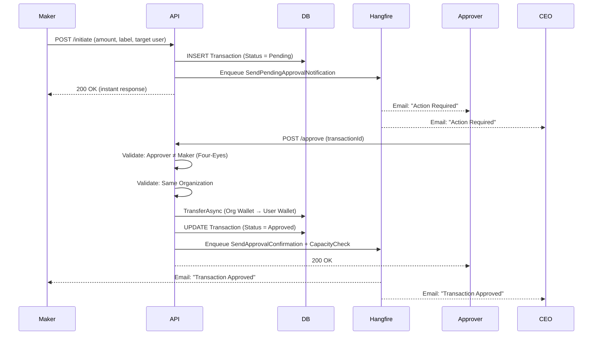
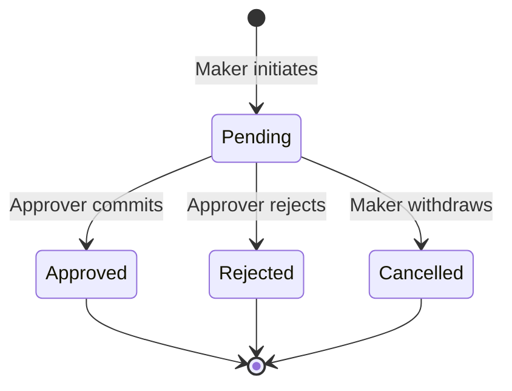

# Financial Workflow (Maker-Checker)

FMC enforces a strict **Four-Eyes Principle** for all financial movements. No single user can both initiate and settle a transaction.

### Transaction States

