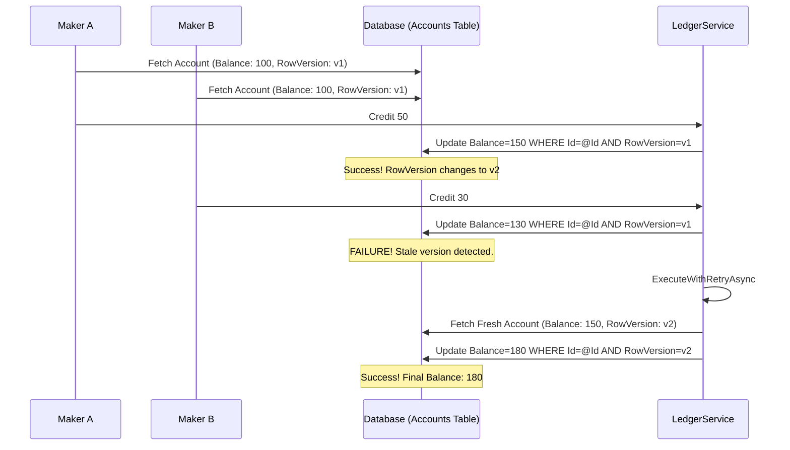
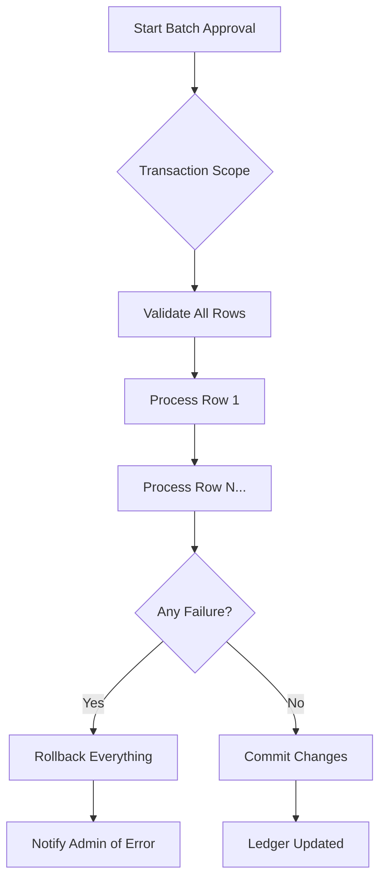

# Ledger Integrity & Hardening Architecture

This document describes the institutional-grade safeguards implemented in the FMC financial engine to ensure data integrity, atomicity, and concurrency safety.

## 1. Concurrency Control: Optimistic Locking
To prevent "lost updates" and race conditions during high-volume ledger adjustments, we utilize **Optimistic Concurrency Control (OCC)**.

### Architecture Flow

## 2. Request Idempotency
To prevent double-submissions (e.g., from UI double-clicks or network retries), every transaction request carries a unique `IdempotencyKey`.

*   **Key Generation:** Generated on the client-side (Blazor) at the moment of submission.
*   **Database Enforcement:** A unique index on `Transactions.IdempotencyKey` prevents duplicate entries at the storage level.
*   **Scope:** Applied to individual adjustments and entire payroll batches.

## 3. Atomic Batch Operations
Bulk operations (like payroll approvals) are wrapped in an explicit `IDbContextTransaction`. This ensures the system maintains a zero-sum state even if an infrastructure failure occurs mid-batch.

## 4. Settlement & Negative Balances
The system strictly enforces positive balances for standard operations but provides a "Settlement Recovery Mode" for authorized reversals (e.g., employee resignation).

| Feature | Standard Mode | Settlement Mode |
| :--- | :--- | :--- |
| **Logic** | `allowNegative = false` | `allowNegative = true` |
| **Trigger** | Normal Allotment | Reversal / Resignation |
| **User Balance** | Minimum ₱0.00 | Can be < ₱0.00 |
| **Audit Log** | Category: Adjustment | Category: Settlement |

## 5. Nightly Reconciliation
A background job (`ReconciliationService`) executes every night at 2:00 AM to verify that the cached `Account.Balance` exactly matches the aggregate sum of all `Approved` transactions.

*   **Formula:** `ExpectedBalance = Σ(Transactions where Status='Approved')`
*   **Action on Drift:** Raises a `High` priority `SystemAlert` and logs the variance for forensic investigation.

## 6. Technical Specifications
*   **Decimal Precision:** All financial fields are mapped to `decimal(18,2)` to prevent floating-point calculation drift.
*   **Retry Policy:** 3 attempts with exponential backoff for concurrency exceptions.
*   **Storage:** unique constraint on `Transactions.IdempotencyKey`.
