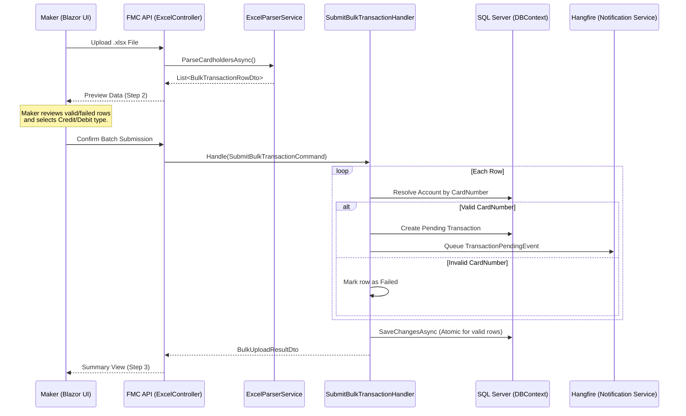

# Maker Bulk Upload Feature Documentation

## Overview
The **Maker Bulk Upload** feature allows users with the `Maker` role to perform high-volume cardholder transactions using Excel (.xlsx) files. This feature is designed to reduce manual entry errors and improve operational efficiency for organization administrators.

## Logic Flow
The following diagram illustrates the lifecycle of a bulk upload request from file selection to final notification.

## Architectural Components

### 1. Presentation Layer (Blazor)
- **`BulkUploadDialog.razor`**: A 3-step wizard that handles file selection, data preview/validation feedback, and final submission summary.
- **`OrganizationApiService.cs`**: Client-side wrapper for interacting with the Excel and Organization API endpoints.

### 2. API Layer (ASP.NET Core)
- **`ExcelController`**: Provides an endpoint to parse Excel streams into DTOs without persisting data.
- **`OrganizationsController`**: Contains the bulk submission endpoint which triggers the MediatR command.

### 3. Application Layer (MediatR)
- **`SubmitBulkTransactionCommand`**: Encapsulates the batch data and organizational context.
- **`SubmitBulkTransactionCommandHandler`**: Implements the "Partial Success" business logic, ensuring valid transactions are created even if some rows in the file are invalid.

### 4. Infrastructure Layer
- **`ExcelParserService`**: Uses **ClosedXML** to read spreadsheet data. Enforces a 100-row maximum safety limit.
- **`OrganizationRepository`**: Resolves cardholders using a join between `Accounts` and `ApplicationUsers` based on the `AccountNumber` (CardNumber) field.

## Data Mapping & Validation
| Excel Column | DTO Property | Database Field | Validation |
| :--- | :--- | :--- | :--- |
| **Subscriber** | `Subscriber` | (Display only) | None |
| **CardNumber** | `CardNumber` | `ApplicationUser.AccountNumber` | Must exist within the Organization |
| **Amount** | `Amount` | `Transaction.Amount` | Must be a positive decimal |

## Security & Constraints
- **Role-Based Access**: Restricted to users with `Maker` or `SuperAdmin` roles.
- **4-Eyes Principle**: All transactions created via bulk upload are set to `Pending` status and require an `Approver` (other than the Maker) to authorize them.
- **File Limits**: Maximum file size is 5MB; maximum row count is 100 per upload.
- **Multi-Tenancy**: The system strictly resolves cardholders within the `OrganizationId` of the current Maker.
