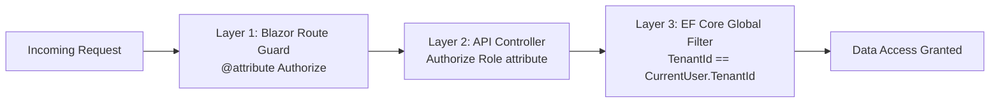
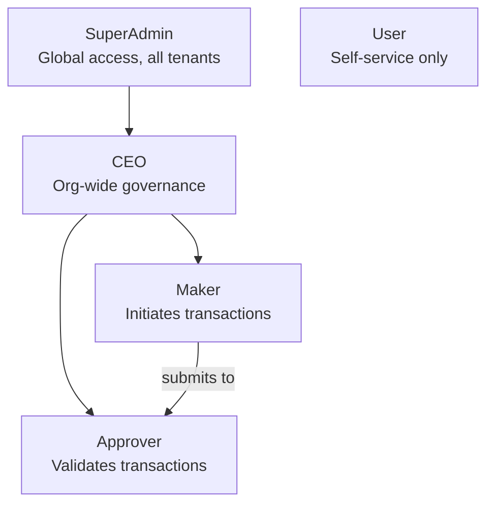
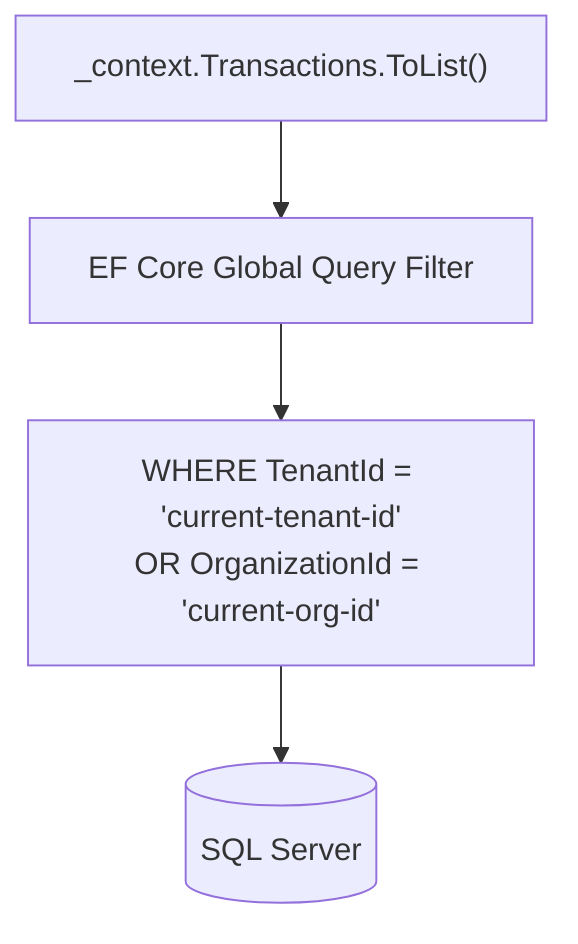

# Role-Based Access Control (RBAC) & Multi-Tenancy

## 1. Role-Based Access Control (RBAC)

Authorization is enforced at three independent layers. Bypassing one does not grant access — all three must pass.



### Role Hierarchy & Permissions



### Permission Matrix

| Capability | SuperAdmin | CEO | Maker | Approver | User |
| :--- | :---: | :---: | :---: | :---: | :---: |
| Fund Organization Wallet | ✅ | ❌ | ❌ | ❌ | ❌ |
| Create Users | ✅ | ✅ | ❌ | ❌ | ❌ |
| Initiate Transaction | ❌ | ❌ | ✅ | ❌ | ❌ |
| Approve / Reject Transaction | ❌ | ❌ | ❌ | ✅ | ❌ |
| View Audit Logs | ✅ | ✅ | ❌ | ❌ | ❌ |
| View Own Profile | ✅ | ✅ | ✅ | ✅ | ✅ |

> [!CAUTION]
> **Four-Eyes Enforcement**: A Maker **cannot** approve their own transaction. The service layer compares `transaction.MakerId == approverId` and throws if they match.

> [!IMPORTANT]
> **Role Sync**: When a role changes, the user must re-authenticate (next login or token refresh) for the new claims to take effect in the browser.

---

## 2. Multi-Tenancy & Data Isolation

Every row in the database that belongs to a tenant is silently filtered by **Global Query Filters** in `ApplicationDbContext`. A user can never query another organization's data, even with a direct SQL-equivalent LINQ statement.



### Tenant Context Resolution

`CurrentUserService` is the single source of truth for the active user's identity within a request:

```csharp
// Reads from JWT claims on every request — zero DB round-trips
public string? TenantId        => _httpContext.User.FindFirst("TenantId")?.Value;
public Guid?   OrganizationId  => ...parsed from claims...
public bool    IsSuperAdmin    => _httpContext.User.IsInRole(Roles.SuperAdmin);
```

`IsSuperAdmin` bypasses the tenant filter entirely, granting global visibility — used for system administration only.
