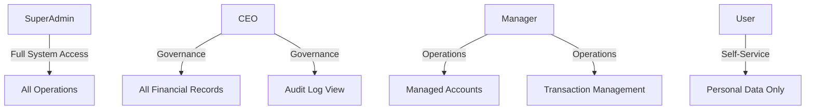

# Role-Based Access Control (RBAC) & Permissions

This document outlines the **Authorization Architecture** of the Finance Management Console (FMC), defining how user privileges are enforced, managed, and audited.

---

## 1. Security Hierarchy

FMC uses a high-granularity RBAC model. Permissions are tied to **Roles**, which are then associated with individual user tokens. 



---

## 2. Role Definitions & Privilege Matrix

| Role | Responsibility | Data Visibility | Core Permissions |
| :--- | :--- | :--- | :--- |
| **SuperAdmin** | Infrastructure & Global Management | **Global (All Tenants)** | User Provisioning, System Config, Global Logs, Role Management. |
| **CEO** | Business Oversight | **Tenant Wide** | Full Financial Audit, Executive Dashboards, System Logs. |
| **Manager** | Operational Supervision | **Assigned Groups**| Transaction Approval, Account Management, Team Reporting. |
| **User** | Standard Operations | **Owned Objects Only** | Personal Dashboard, Transaction Entry, Profile Management. |

---

## 3. Enforcement Layers

FMC implements security at three distinct levels to prevent unauthorized access (Broken Function Level Authorization):

### A. Route Authorization (Blazor)
Pages are guarded using the `[Authorize(Roles = ...)]` attribute, ensuring that unauthorized users cannot even render the UI component.
```razor
@page "/admin/manage-users"
@attribute [Authorize(Roles = Roles.SuperAdmin)]
@inject AdminService AdminService
```

### B. Controller Authorization (REST API)
The back-end controllers enforce role checks on every incoming HTTP request. This prevents attackers from bypassing the UI and hitting the API directly.
```csharp
[Authorize(Roles = Roles.SuperAdmin)]
[ApiController]
[Route("api/[controller]")]
public class UsersController : ControllerBase { ... }
```

### C. Data Filter Layer (Entity Framework)
Even if a role permits viewing a record, the **Multi-Tenant Filter** ensures a user only sees data belonging to their own `TenantId`.

---

## 4. Permission Mapping

| Module | SuperAdmin | CEO | Manager | User |
| :--- | :---: | :---: | :---: | :---: |
| **User Creation** | ✅ | ❌ | ❌ | ❌ |
| **View Audit Logs**| ✅ | ✅ | ❌ | ❌ |
| **Global Financials**| ✅ | ✅ | ❌ | ❌ |
| **Approve Transactions**| ✅ | ✅ | ✅ | ❌ |
| **Personal Profile** | ✅ | ✅ | ✅ | ✅ |

---

## 5. Security Guardrails

> [!CAUTION]
> **SuperAdmin Exception**: A `SuperAdmin` should never be deleted. The system must always have at least one root-level account to manage recovery.

> [!IMPORTANT]
> **Role Escalation Protection**: When a SuperAdmin updates a user's role in the `UserDialog`, the change is immediately synchronized to the database. However, the user must **Refresh their Token** (next login or refresh) for the new roles to take effect in the browser.

---

*Document Version 1.0 - Last Refined: 2026-03-27*
