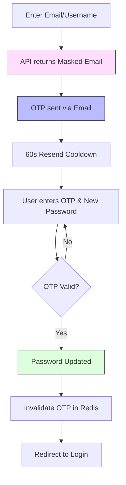

# Authentication & User Lifecycle Workflows

This document outlines the enterprise-grade workflows for user registration and password recovery within the **Finance Management Console (FMC)**. These flows prioritize security, forensic auditability, and a premium user experience.

---

## 1. Institutional User Provisioning
 
 FMC uses a closed-loop user lifecycle. Public registration is disabled to ensure all identities are verified by an institutional administrator (CEO or SuperAdmin) before account activation.
 
 ### Workflow Steps:
 1.  **Administrative Grant**: 
    -   A CEO or SuperAdmin opens the `UserDialog.razor` from the management dashboard.
    -   Personnel details and system roles (Maker, Approver, User) are specified.
 2.  **Entity Materialization**:
    -   The system creates the `ApplicationUser` with `EmailConfirmed = true` by default.
    -   A temporary system-generated account number is assigned (prefix `63641`).
 3.  **Secure Handover**:
    -   The administrator communicates the initial credentials to the user via secure internal channels.
 
 ### Workflow Visualization:
 ```mermaid
 graph TD
     A[Admin opens User Management] --> B[Fill Personnel Details]
     B --> C[Assign Roles: Maker/Approver/User]
     C --> D[Submit to IdentityService.CreateUserAsync]
     D --> E[Account Created: EmailConfirmed = true]
     E --> F[User Login Authorized]
 ```

---

## 2. Secure Password Recovery (Forgot Password)

FMC implements a "Privacy-First" recovery flow that protects against email enumeration while providing clear guidance to legitimate users.

### Workflow Steps:
1.  **Initiation (`ForgotPassword.razor`)**:
    -   User enters their Username or Email identifier.
2.  **Security Masking & Enumeration Protection**:
    -   The system returns a **Masked Email** (e.g., `d***********@domain.com`) to confirm where the code was sent without revealing the full address.
    -   The API returns a generic success message even if the user does not exist, preventing malicious actors from fishing for valid accounts.
3.  **Rate Limiting (Resend Cooldown)**:
    -   An inline **60-second timer** is triggered in the UI.
    -   The "Resend Code" button is disabled and displays a live countdown to mitigate email spamming.
4.  **Verification & Reset**:
    -   User provides the 6-digit OTP along with their new password.
    -   The UI uses a **Grid System** to maintain perfect alignment and responsiveness on mobile.
    -   The back-end validates the OTP against the Redis cache and applies the reset via `UserManager`.

### Workflow Visualization:


---

## 3. Administrative User Creation (SuperAdmin / CEO)
 
 Authorized administrators can provision system accounts directly via the management interface.
 
 ### Workflow Steps:
 1.  **Dialog Management (`UserDialog.razor`)**:
     -   Accessed via the `Manage Users` dashboard or `Organization Profile`.
     -   Supports granular role assignments (**Maker**, **Approver**, **User**).
 2.  **UI Hardening**:
     -   Form validation prevents submission of incomplete or duplicate identities.
 3.  **Data Persistence**:
     -   Created users are assigned their specific roles and locked to their organization.
 
 ---
 
 ## 4. Security & Audit Specifications
 
 | Feature | Implementation Detail |
 | :--- | :--- |
 | **Authentication Mode**| Closed Loop (Administrative Provisioning Only) |
 | **Audit Logging** | Every Login, User Creation, and Reset is logged via `RecordAuthEventAsync`. |
 | **Forensic Data** | Logs capture Timestamp, IP Address, Event Type, and Admin ID (for accountability). |
 | **Password Security** | Standardized Identity rules enforced on all administrative passwords. |
 
 ---
 
 > [!IMPORTANT]
 > **Audit Integrity**: All administrative creation events are logged under the "User Created" category, identifying both the new user and the administrator responsible for the provisioning.
 
 *Document Version 1.1 - Last Refined: 2026-04-13*
