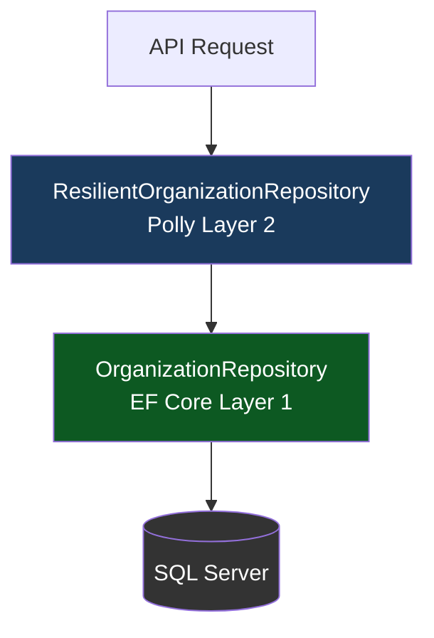

# 🛡️ Resilience & Performance Architecture

This document describes the enterprise-grade **fault tolerance and performance optimization** infrastructure implemented in the Finance Management Console. The system is designed to remain stable on company-owned servers, gracefully recovering from transient faults without user-visible errors.

> **Last Updated**: 2026-04-20

---

## 1. Overview: Defense-in-Depth

FMC uses **two independent resilience layers** on every database operation, plus a **performance batching layer** for high-volume data retrieval.



---

## 2. Layer 1 — EF Core Built-In SQL Retry

Configured in `Program.cs` via `EnableRetryOnFailure`:

```csharp
options.UseSqlServer(connectionString, sqlOptions =>
    sqlOptions.EnableRetryOnFailure(
        maxRetryCount: 5,
        maxRetryDelay: TimeSpan.FromSeconds(10),
        errorNumbersToAdd: null));
```

**What it handles:** Known SQL Server transient error codes (deadlocks, connection resets, resource pool exhaustion). Retries up to 5 times with a capped 10-second delay.

---

## 3. Layer 2 — Polly Resilience Pipeline

Defined in `FMC.Infrastructure/Resilience/ResiliencePolicies.cs`.

### Database Retry Pipeline
- **Retries**: 3 attempts with exponential back-off (2s → 4s → 8s)
- **Jitter**: Enabled — prevents "thundering herd" on simultaneous server restarts
- **Handles**: `SqlException`, `TimeoutException`, `TaskCanceledException`
- **On Retry**: Logs a structured warning with attempt number and error cause

### Circuit Breaker (for Future External API)
Pre-built policy ready for when you connect to the company Cardholder server:
- **Trips at**: 50% failure rate over 5+ calls within 30 seconds
- **Break Duration**: 60 seconds of fast-failing (no hanging requests)
- **States Logged**: Opened, Half-Open, Closed

### The Decorator Pattern
`ResilientOrganizationRepository` wraps `OrganizationRepository` transparently:

```csharp
// In Program.cs:
builder.Services.AddScoped<OrganizationRepository>();               // The real one
builder.Services.AddScoped<IOrganizationRepository,              // What the app uses
    ResilientOrganizationRepository>();

// Usage in services is completely unchanged:
var orgs = await _repository.GetAllWithStatsAsync(ct); // Polly retrying invisibly
```

**Benefit**: When you add a `CardholderRepository` for your company server, you just create a `ResilientCardholderRepository` using the same `ResiliencePolicies` class — zero duplication.

---

## 4. Performance Orchestration — Batched Queries

### Problem: O(N) Sequential Queries
The original `GetAllAsync` performed sequential per-organization database calls:
- 100 organizations = **300+ database round-trips** (count, org balance, user balance per org)

### Solution: 4-Batch Pattern
`OrganizationRepository.GetAllWithStatsAsync()` fetches everything in **4 parallel-friendly queries**:

| Batch | Query | Data Retrieved |
| :---: | :--- | :--- |
| 1 | `Organizations` table | All org records |
| 2 | `Users GROUP BY OrganizationId` | User count per org |
| 3 | `Accounts WHERE TenantId IN (orgIds)` | Org wallet balances |
| 4 | `JOIN Users+Accounts GROUP BY OrgId` | Total user balances per org |
| 5 | `Users WHERE Id IN (ceoIds)` | CEO display names |

**Result**: 100 organizations now requires **5 queries** instead of 300+. A **98% reduction** in database round-trips.

---

## 5. Database Indexes Added

Added to `ApplicationDbContext.OnModelCreating` for high-speed query performance:

```csharp
builder.Entity<Transaction>().HasIndex(t => t.OrganizationId);
builder.Entity<Transaction>().HasIndex(t => t.Date);
builder.Entity<Transaction>().HasIndex(t => t.Status);
```

These power the `GetWorkflowAlertsAsync`, `GetTransactionsByStatusAsync`, and `GetProcessedTransactionsSinceAsync` queries — transforming full-table scans into index seeks.

---

## 6. Workflow Alert Resilience

`OrganizationService.GetWorkflowAlertsAsync` now uses:
- The specialized `GetProcessedTransactionsSinceAsync` (filters at SQL level, not in memory)
- A `try/catch (OperationCanceledException)` block that returns an empty list instead of a 500 error when the browser navigates away mid-request
