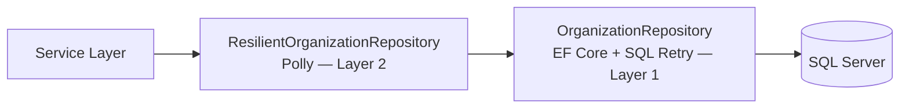
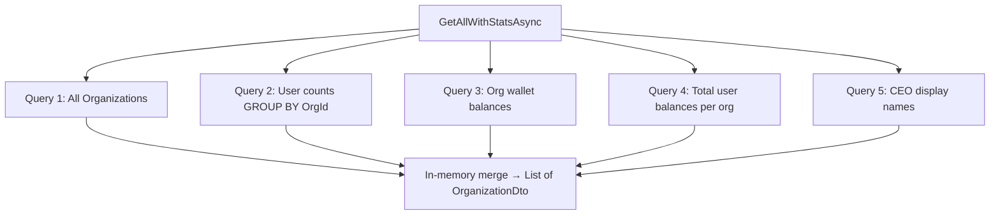

# Resilience & Performance Architecture

## 1. Two-Layer Database Resilience

Every database operation is protected by two independent fault-tolerance layers:



| Layer | Technology | Handles | Retry Count |
| :--- | :--- | :--- | :--- |
| **Layer 1** | EF Core `EnableRetryOnFailure` | Known SQL transient error codes | 5 retries, max 10s delay |
| **Layer 2** | Polly `ResiliencePipeline` | `SqlException`, `TimeoutException`, `TaskCanceledException` | 3 retries, exponential back-off (2s→4s→8s) |

## 2. Batched Query Optimization

The original `GetAllAsync` caused **O(N) database round-trips** — 100 organizations = 300+ queries. The refactored `GetAllWithStatsAsync` fetches all data in **5 fixed queries**, regardless of organization count:



**Result**: ~98% reduction in database round-trips on the Organization list page.

## 3. Performance Indexes

Added to `ApplicationDbContext.OnModelCreating` to ensure ledger queries use index seeks:

```csharp
builder.Entity<Transaction>().HasIndex(t => t.OrganizationId);
builder.Entity<Transaction>().HasIndex(t => t.Date);
builder.Entity<Transaction>().HasIndex(t => t.Status);
```

## 4. Circuit Breaker (Future External API)

`ResiliencePolicies.GetExternalServiceCircuitBreaker()` is pre-built for when the company Cardholder server is connected:
- Trips if 50%+ of calls fail within 30 seconds (minimum 5 samples)
- Breaks for 60 seconds (fast-fail, no hanging requests)
- Logs state transitions: Opened → Half-Open → Closed
