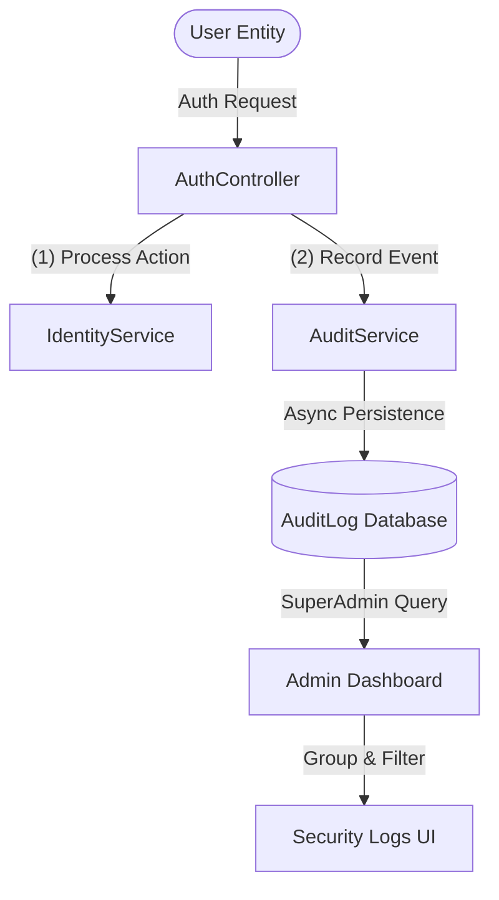
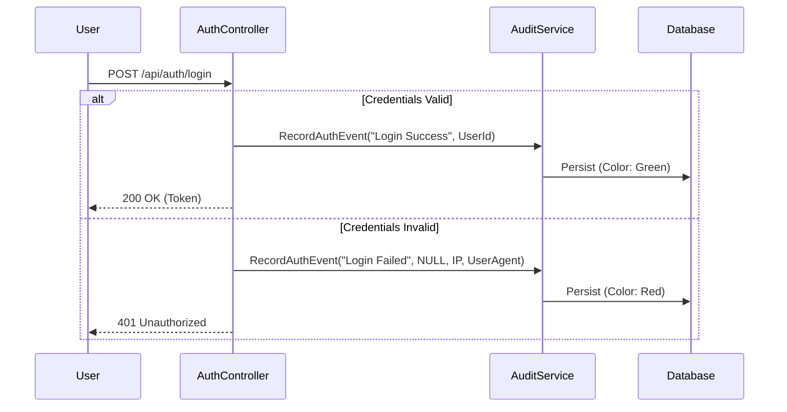

# Security & Forensic Audit Architecture

This document describes the design and implementation of the **Categorized Audit Logging System** within the Finance Management Console (FMC). This system is engineered for high-visibility security monitoring and rapid forensic investigation.

---

## 1. Architectural Overview

The auditing engine is designed as a **Cross-Cutting Concern**, decoupled from the business logic but integrated into every sensitive gateway (Authentication, Profile Changes, Financial Operations).

---

## 2. Categorized Event Lifecycle

Unlike standard logging, FMC uses **Categorized Actions**. Every event is tagged with a specific status that determines its visual representation and risk level.

### Authentication Sequence

---

## 3. Core Event Classification

The system uses a strictly defined taxonomy of events to ensure searchability and enterprise-grade reporting:

| Category | Trigger Point | Risk Level | UI Representation |
| :--- | :--- | :--- | :--- |
| **Login Success** | Successful session initiation. | Low | 🟢 Success Chip |
| **Login Failed**| Invalid password/identifier provided. | **High** | 🔴 Error Chip |
| **Logout** | Explicit session termination. | Low | ⚪ Default Chip |
| **Password Reset**| OTP-based account recovery completion. | Medium | 🟡 Warning Chip |
| **Registration** | New system account created. | Medium | 🔵 Info Chip |
| **Password Changed**| Logged-in user updated their credentials. | Medium | 🟡 Warning Chip |

---

## 4. Investigative UI Features

The **Security Logs Dashboard** (`/admin/login-logs`) provides advanced tools for SuperAdmins to handle "Event Flooding":

### A. Dynamic Pivot Grouping
Administrators can re-aggregate the entire audit history based on:
-   **User**: Track a specific individual's session history across multiple nodes.
-   **Action**: Identify system-wide trends (e.g., *Are we currently under a brute-force attack?*).
-   **Day**: Segment events by calendar date to isolate suspicious activity to a specific window.

### B. Forensic Metadata
Every audit record captures immutable environmental data:
-   **IP Address**: Traces the source of the request.
-   **Details (User Agent)**: Captures the user's Browser, Operating System, and Hardware details for device fingerprinting.

---

## 5. Security Guardrails

> [!WARNING]
> **Immutability Principle**: The `AuditService` does not provide an "Update" or "Delete" method. Once an event is recorded in the `AuditLog` table, it is considererd a permanent forensic record.

> [!TIP]
> **Performance**: The system uses `Take(500)` in the retrieval layer to ensure the SuperAdmin dashboard remains snappy even as the audit database grows into thousands of records.

---

*Document Version 1.1 - Last Refined: 2026-03-27*
