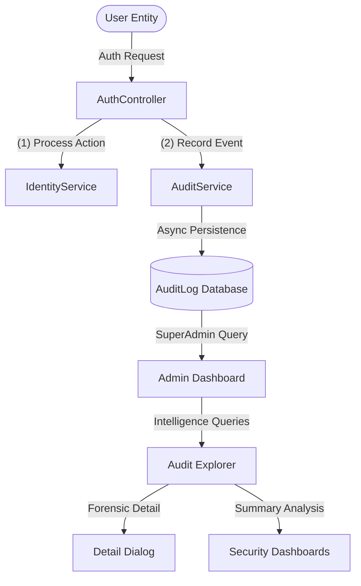
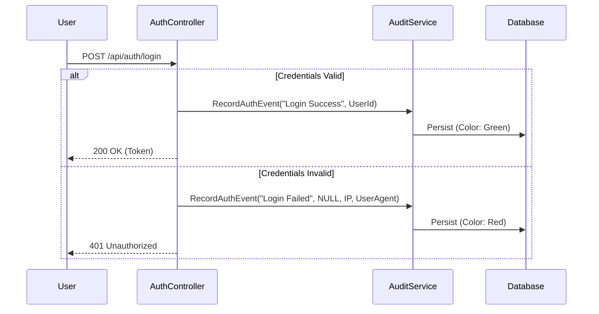

# Security & Forensic Audit Architecture

This document describes the design and implementation of the **Categorized Audit Logging System** within the Finance Management Console (FMC). This system is engineered for high-visibility security monitoring and rapid forensic investigation.

---

## 1. Architectural Overview

The auditing engine is designed as a **Cross-Cutting Concern**, decoupled from the business logic but integrated into every sensitive gateway (Authentication, Profile Changes, Financial Operations).

---

## 2. Categorized Event Lifecycle

Unlike standard logging, FMC uses **Categorized Actions**. Every event is tagged with a specific status that determines its visual representation and risk level.

### Authentication Sequence

---

## 3. Core Event Classification

The system uses a strictly defined taxonomy of events to ensure searchability and enterprise-grade reporting:

| Category | Trigger Point | Risk Level | UI Representation |
| :--- | :--- | :--- | :--- |
| **Login Success** | Successful session initiation. | Low | 🟢 Success Chip |
| **Login Failed**| Invalid password/identifier provided. | **High** | 🔴 Error Chip |
| **Logout** | Explicit session termination. | Low | ⚪ Default Chip |
| **Password Reset**| OTP-based account recovery completion. | Medium | 🟡 Warning Chip |
| **Registration** | New system account created. | Medium | 🔵 Info Chip |
| **Financial Op** | High-magnitude credit/debit event. | **High** | 🟢/🔴 Magnitude Chip |
| **System Health** | Resource threshold or anomalous spike. | **High** | 🟠 Alert Chip |
| **Password Changed**| Logged-in user updated their credentials. | Medium | 🟡 Warning Chip |

---

## 4. Investigative UI Features

The **Security Logs Dashboard** (`/admin/login-logs`) provides advanced tools for SuperAdmins to handle "Event Flooding":

### A. Audit Intelligence Explorer
The primary forensic tool (`/admin/audit`) provides:
- **Responsive Dynamic Grid**: Collapsible columns for mobile-first forensic analysis.
- **Audit Detail View**: A high-fidelity modal providing a complete **Forensic Data Trace** of any individual event.

### B. Deep Forensic Telemetry
Every audit record now captures expanded diagnostic metadata:
- **Source IP Address**: Direct resolution of the request origin.
- **Digital Device Fingerprint**: Captures the exact browser, OS, and hardware identifiers.
- **Financial Magnitude**: For ledger-impacting events, the exact amount and currency label.
- **Performance Identity**: The specific display name of the operator who triggered the event.

---

---

## 6. Real-Time System Monitoring

Starting with version 1.2, FMC includes the **Health Monitor Engine**:
- **Background Tracking**: The `HealthMonitorService` continuously audits system resource usage and traffic patterns.
- **Automated Alerts**: Anomalous events (High-frequency logins, threshold breaches) automatically generate `SystemAlerts`.
- **Global Visibility**: Alerts are broadcast to the SuperAdmin console via the `AlertsController` and displayed in the global navigation shell.

---

> [!WARNING]
> **Immutability Principle**: The `AuditService` does not provide an "Update" or "Delete" method. Once an event is recorded in the `AuditLog` table, it is considererd a permanent forensic record.

> [!TIP]
> **Intelligence Scaling**: The `AuditExplorer` uses a server-side query architecture with `AuditLogQueryDto` to ensure that data remains navigable even with millions of historical records.

---

*Document Version 1.2 - Last Refined: 2026-04-06*
