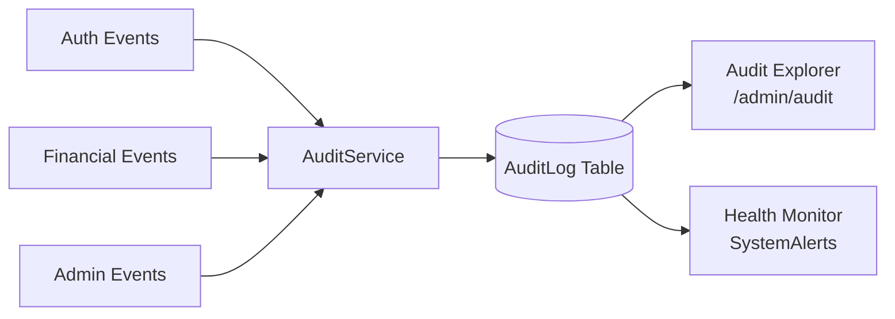
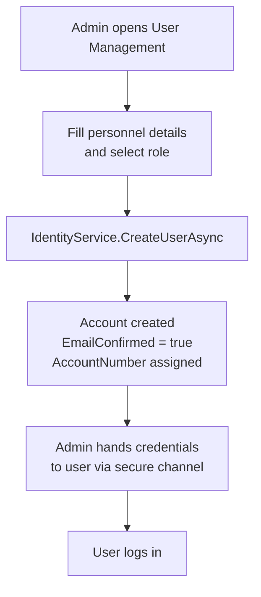
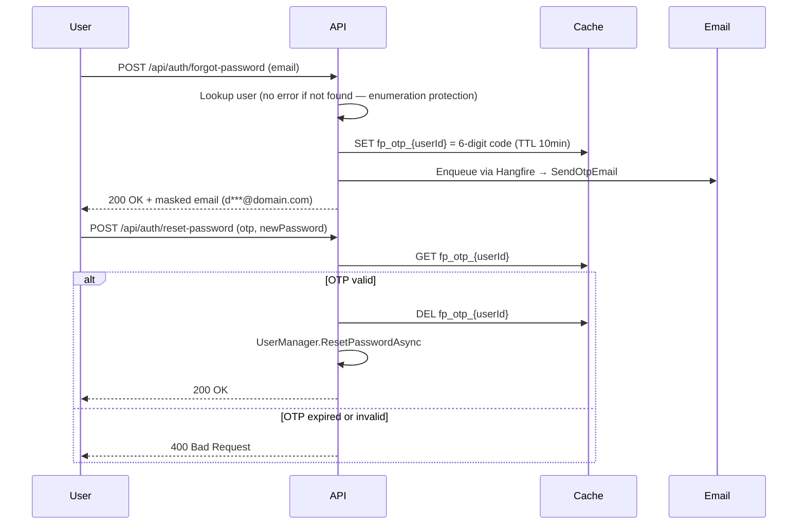

# Security, Audit & User Lifecycle

## 1. Audit Log Architecture

Every sensitive system event is written to `AuditLog` via `AuditService`. The table is **append-only** — no Update or Delete methods exist on `AuditService`.

### Audit Event Taxonomy

| Event | Risk Level | Trigger |
| :--- | :---: | :--- |
| `Login Success` | Low | Valid credentials presented |
| `Login Failed` | High | Invalid credentials (IP + UserAgent captured) |
| `Logout` | Low | Session explicitly terminated |
| `Password Reset` | Medium | OTP-based recovery completed |
| `User Created` | Medium | Admin provisions new account |
| `WALLET_FUNDED` | High | SuperAdmin credits org wallet |
| `TRANSACTION_APPROVED` | High | Approver settles a Maker request |
| `APPROVAL_BLOCKED` | Critical | Four-Eyes or cross-org violation attempt |

> [!WARNING]
> **Immutability**: The AuditLog table has no update or delete pathway. Records are forensic evidence and must be treated as permanent.

---

## 2. User Provisioning

FMC uses **closed-loop provisioning** — no public registration. All accounts are created by a CEO or SuperAdmin.

---

## 3. Password Recovery (Forgot Password)

**Rate-Limiting**: A 60-second cooldown timer is enforced in the UI on the "Resend Code" button to prevent email flooding.
