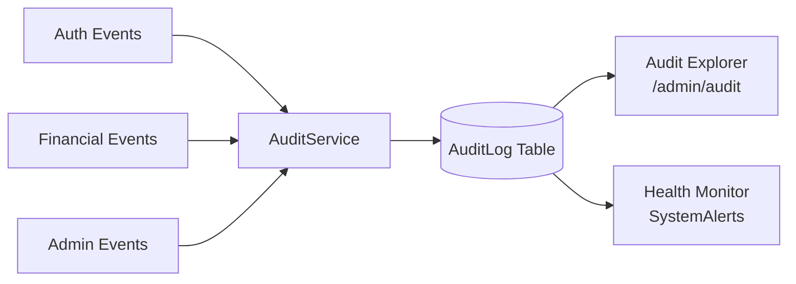
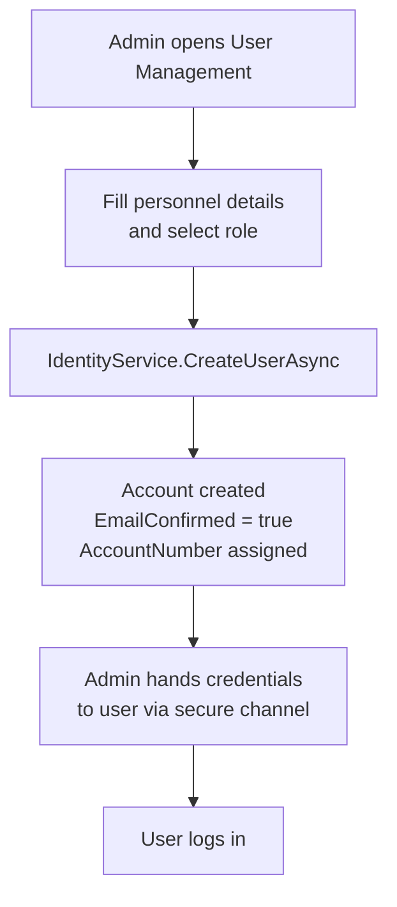
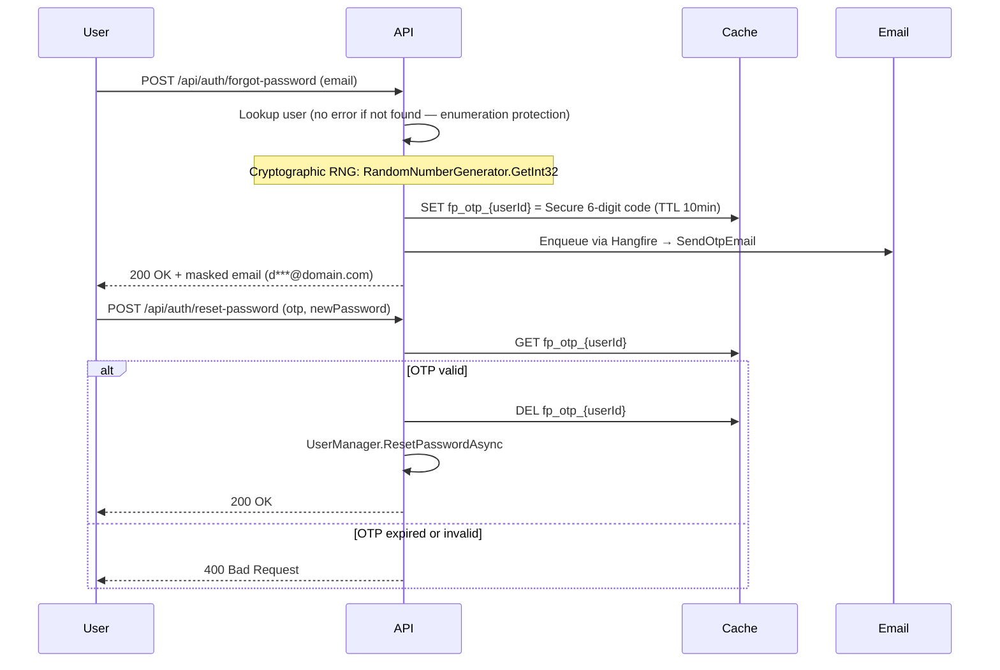
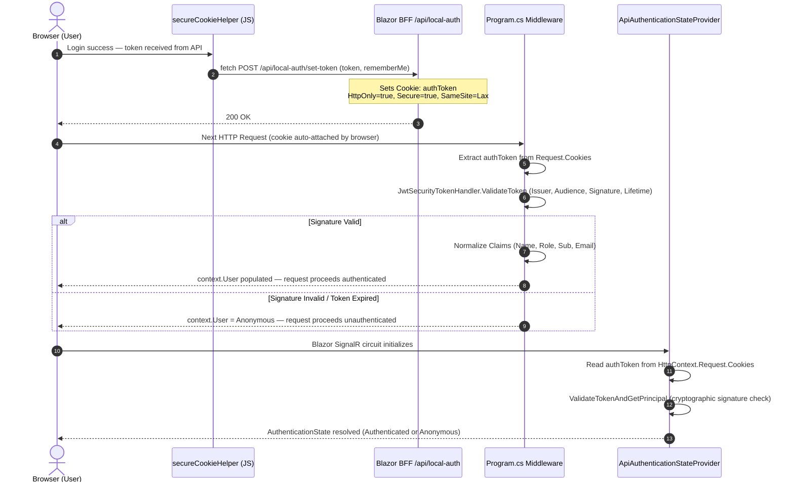
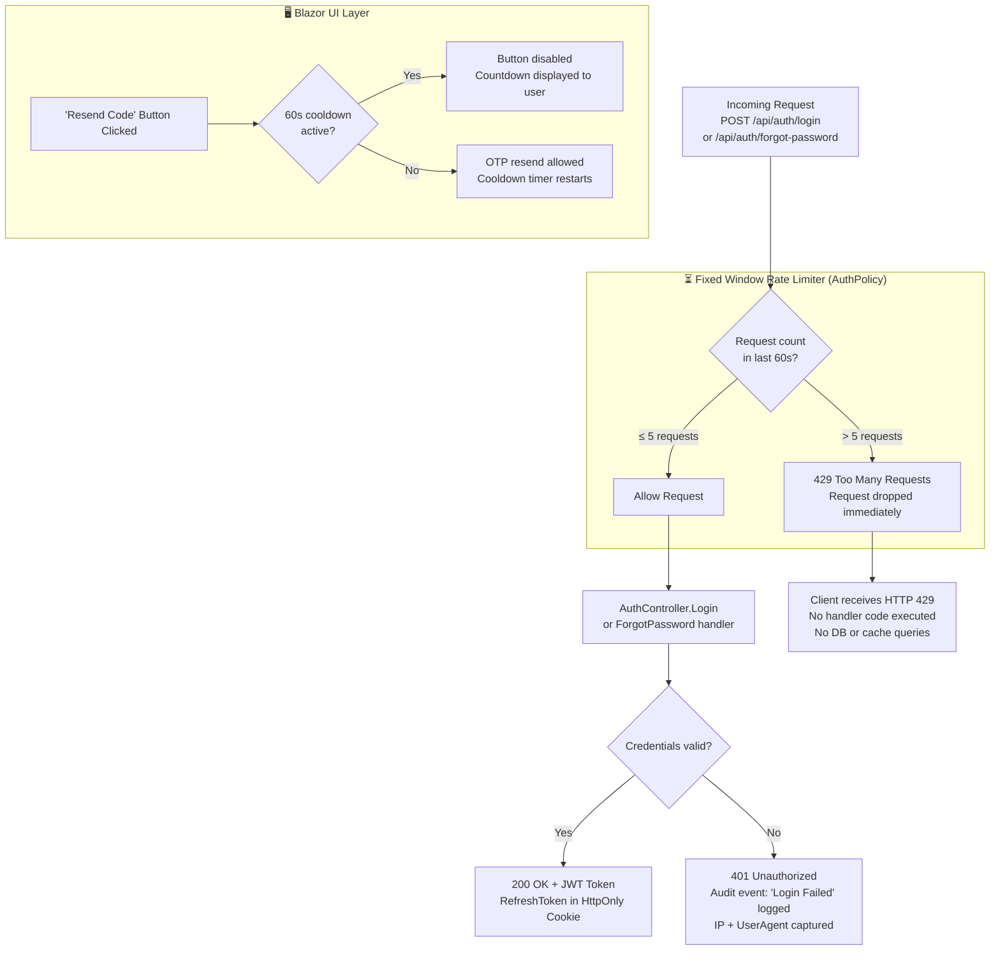

# Security, Audit & User Lifecycle

## 1. Audit Log Architecture

Every sensitive system event is written to `AuditLog` via `AuditService`. The table is **append-only** — no Update or Delete methods exist on `AuditService`.

### Audit Event Taxonomy

| Event | Risk Level | Trigger |
| :--- | :---: | :--- |
| `Login Success` | Low | Valid credentials presented |
| `Login Failed` | High | Invalid credentials (IP + UserAgent captured) |
| `Logout` | Low | Session explicitly terminated |
| `Password Reset` | Medium | OTP-based recovery completed |
| `User Created` | Medium | Admin provisions new account |
| `WALLET_FUNDED` | High | SuperAdmin credits org wallet |
| `TRANSACTION_APPROVED` | High | Approver settles a Maker request |
| `APPROVAL_BLOCKED` | Critical | Four-Eyes or cross-org violation attempt |

> [!WARNING]
> **Immutability**: The AuditLog table has no update or delete pathway. Records are forensic evidence and must be treated as permanent.

---

## 2. User Provisioning

FMC uses **closed-loop provisioning** — no public registration. All accounts are created by a CEO or SuperAdmin.

---

## 3. Password Recovery (Forgot Password)

### 🔒 4. Session Protection, BFF Cookie Flow & JWT Verification

* **Authentication Storage**: Direct local storage of tokens in the browser is prohibited to prevent XSS-based theft.
* **HttpOnly Session Cookies**: Authenticated sessions are fully mediated by Blazor-managed, server-side HTTP `authToken` cookies configured with `HttpOnly = true`, `Secure = true`, and `SameSite = SameSiteMode.Lax`.
* **Cryptographic Check**: The Custom Middleware in `Program.cs` and the scoped `ApiAuthenticationStateProvider` decode and validate incoming token signatures cryptographically using the synchronized symmetric security key.

> [!IMPORTANT]
> **XSS Protection**: Since `authToken` is `HttpOnly`, JavaScript (including any injected XSS payloads) has **zero ability** to read or exfiltrate the token via `document.cookie` or `fetch`.

---

### ⏳ 5. Rate-Limiting & Flood Control

* **API-Level Rate Limiting**: A strict backend Fixed Window Rate Limiter policy (`AuthPolicy`) is enforced on all authentication controllers in `FMC.Api`:
  - **Limit**: Max **5 requests per minute**.
  - **Action**: Violators are dropped immediately and receive a `429 Too Many Requests` HTTP status code to block brute force dictionary and automated credentials attacks.
* **UI-Level Cooldown**: A 60-second reactive cooldown timer is enforced directly on the Blazor user interface "Resend Code" button to prevent automated email server flooding.

> [!WARNING]
> **Scope Restriction**: The `AuthPolicy` rate limiter applies exclusively to `AuthController`. All other API controllers (e.g., `OrganizationsController`, `UsersController`) are protected by JWT bearer authentication and RBAC role policies.
