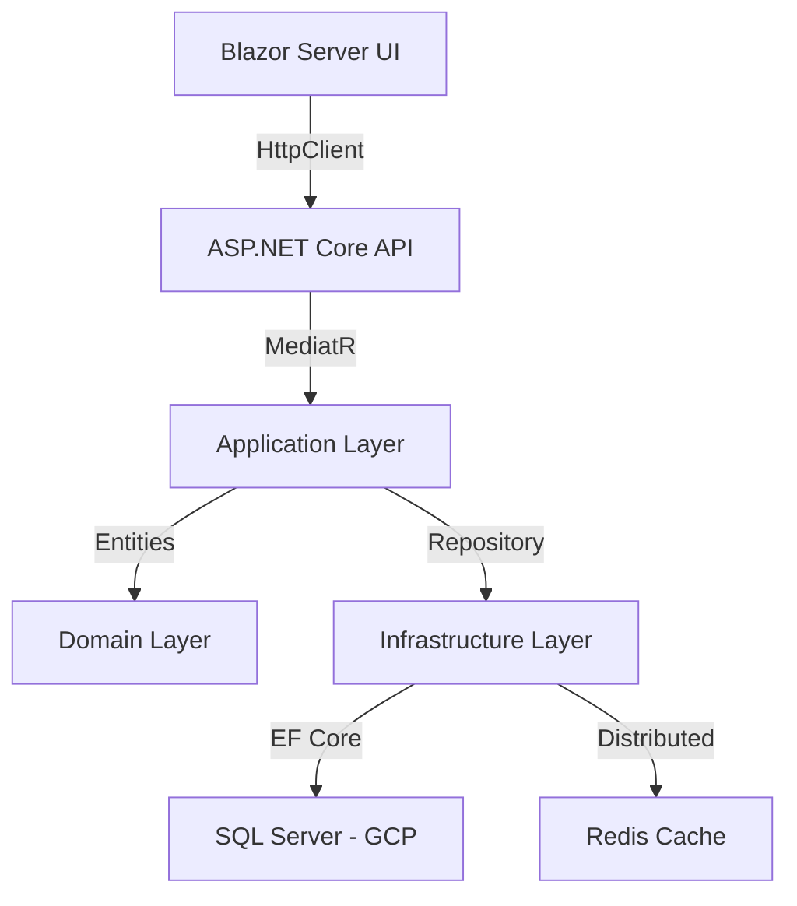

# Finance Management Console (FMC)

[](https://cloud.google.com/sql)
[](https://dotnet.microsoft.com/)
[](LICENSE)

**FMC (Finance Management Console)** is a high-performance, multi-tenant financial platform built for scale. Architected using **Clean Architecture** and **Domain-Driven Design (DDD)** principles, it provides a decoupled REST API backend and a sophisticated Blazor Server frontend powered by **MudBlazor 9**.

---

## 🏛 Architecture & Security Pillars

FMC is built on a 6-layer decoupled infrastructure to ensure future-proof scalability and strict security boundaries.



### **1. Identity & Session Hardening**
- **JWT + Refresh Tokens**: State-of-the-art token-based sessions with `HttpOnly` cookie distribution for protection against XSS/CSRF.
- **Refresh Token Rotation**: Continuous rotation policy for long-lived sessions.
- **Multi-Factor OTP**: Integration with **MailKit** for 6-digit cryptographic verification codes during registration and high-risk actions.

### **2. Strategic Multi-Tenancy**
- **Isolation by Design**: Every database query is automatically filtered by `TenantId` at the EF Core level.
- **Zero-Knowledge UI**: The frontend extracts tenant context directly from the signed JWT, ensuring users are logically jailed within their own data silo.

### **3. SuperAdmin Forensic Suite**
- **Global Visibility**: Specialized `IgnoreQueryFilters` visibility for SuperAdmins to manage cross-tenant users.
- **Security Audit Logs**: Centralized record of all login/logout events, failed attempts, and browser telemetry for auditing compliance.

---

## ✨ Enterprise Features

### **👤 User Experience**
- **Responsive Financial Grids**: Native sorting, filtering, and pagination for large datasets.
- **Dark Mode Architecture**: Sophisticated `#11111b` palette optimized for prolonged financial analysis.
- **Real-Time Input Heuristics**: Custom C# interceptors (e.g., Caps Lock Detection) during authentication.

### **🛡️ Administrative Governance**
- **Global User Management**: Searchable database of all platform participants with role synchronization.
- **Security Analytics**: View platform-wide authentication trends and health metrics.
- **RBAC Enforcement**: Predefined access policies for `CEO`, `Manager`, and `User` roles.

---

## 🚀 Getting Started (SuperAdmin)

### Prerequisites
- .NET 10 SDK
- SQL Server (GCP Cloud SQL or Local)
- Redis (Optional - for distributed caching)
- SMTP account (Gmail App Password or SendGrid)

### Project Startup
1. **Initialize Infrastructure**: Configure `DefaultConnection` and `SmtpSettings` in `appsettings.json`.
2. **Synchronize Schema**:
   ```bash
   dotnet ef database update --project FMC.Infrastructure --startup-project FMC.Api
   ```
3. **Boot Application Backend**:
   ```bash
   dotnet run --project FMC.Api
   ```
4. **Boot Administrative Frontend**:
   ```bash
   dotnet run --project FMC
   ```

> [!TIP]
> **First-Time Setup**: The `ApplicationDbSeeder` will automatically provision a root **SuperAdmin** account and establish the role hierarchy upon the first successful startup block.

---

## 📡 Documentation & Roadmaps
- [Project Roadmap](project_roadmap.md)
- [API Architecture Roadmap](api_roadmap.md)
- [SuperAdmin Governance Strategy](superadmin_roadmap.md)
