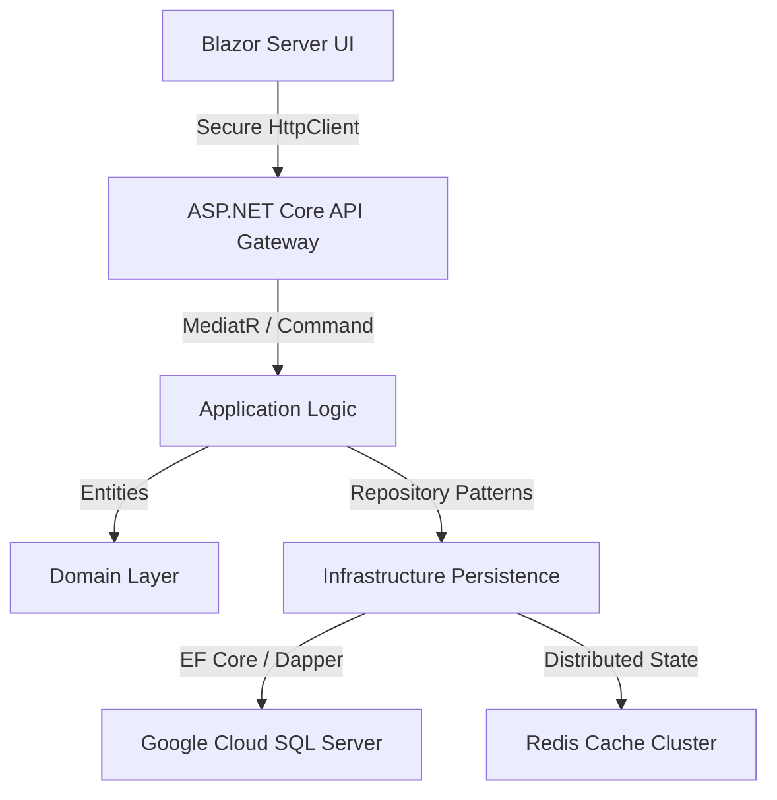

# 🛡️ Finance Management Console (FMC)

[](https://dotnet.microsoft.com/)
[](https://mudblazor.com/)
[](https://cloud.google.com/sql)
[](Documentation/ProjectStructure.md)

**FMC (Finance Management Console)** is a high-performance, multi-tenant financial platform engineered for enterprise-grade scalability. Built on **Clean Architecture** and **Domain-Driven Design (DDD)** principles, it provides a decoupled REST API backend and a sophisticated Blazor Server frontend powered by **MudBlazor 9**.

---

## 🏗️ Architectural Blueprint

FMC is designed as a **6-Layer Decoupled Ecosystem** to ensure strict security boundaries and future-proof maintainability. 

> [!IMPORTANT]
> For a line-by-line breakdown of every file and folder in this solution, please see our [**Project Folder Structure Guide**](Documentation/ProjectStructure.md).

### **High-Level Data Flow**


---

## 🔐 Security & Multi-Tenancy Core

### **1. Identity & Session Hardening**
- **Hybrid Token Auth**: Uses stateless **JWT** for performance and persistent **Refresh Tokens** for long-lived sessions.
- **HttpOnly Cookie Bridge**: Tokens are distributed via `HttpOnly` / `Secure` / `SameSite=Lax` cookies, providing superior protection against **XSS** and **CSRF**.
- **Cryptographic OTP**: Integrated with **MailKit** for 6-digit MFA verification during critical registration and account recovery workflows.

### **2. Strategic Tenant Jailing**
- **Global Query Filters**: Every database query is automatically intercepted and filtered by `TenantId` at the EF Core level.
- **Zero-Trust Frontend**: The UI assumes a "Trust Nothing" posture, resolving tenant permissions directly from the signed JWT payload.

### **3. SuperAdmin Forensic Forensic Suite**
- **Audit Intelligence Explorer**: Advanced real-time forensic grid with high-fidelity detail traces for every session and financial event.
- **System Health Monitoring**: Automated background auditing for anomalous spikes or threshold breaches.
- **Cross-Tenant Visibility**: SuperAdmins can bypass standard tenancy filters to perform global maintenance on users and organizations.

---

## ✨ Enterprise Command Center Features

### **📊 Financial Control**
- **Dynamic Grids**: Enterprise data grids with native multi-column sorting, advanced filtering, and on-the-fly visibility management.
- **Organization Management**: Hierarchical multi-tenant mapping for complex corporate structures.
- **Budgeting Engine**: (Roadmap) Proactive limit enforcement and over-spend notifications.
- **Automated Alerts**: Real-time broadcast engine that notifies administrators of critical infrastructure and security events.

### **🎨 Professional UX**
- **Aesthetic Depth**: A custom-engineered `#11111b` Dark Mode palette designed for reduced eye strain during prolonged financial auditing.
- **Responsive Fluidity**: Zero-gap resizing engines for a desktop-class experience in the browser.
- **Micro-Animations**: Subtle UI transitions that provide immediate visual feedback for every user action.

---

## 🚀 Getting Started (Deployment & Core Boot)

### **Prerequisites**
- **.NET 10 SDK** (LTS recommended)
- **SQL Server 2022+** (GCP Cloud SQL or Local instance)
- **Redis** (For distributed caching / session resilience)
- **SMTP Gateway** (Gmail App Password, SendGrid, or local SMTP)

### **Step-by-Step Initialization**
1. **Infrastructure Configuration**:
   Update `appsettings.json` in both `FMC.Api` and `FMC` with your database and email credentials.

2. **Schema Synchronization**:
   Apply the latest enterprise migrations to your database:
   ```bash
   dotnet ef database update --project FMC.Infrastructure --startup-project FMC.Api
   ```

3. **Backend Service Boot**:
   ```bash
   dotnet run --project FMC.Api
   ```

4. **Frontend Management Console Boot**:
   ```bash
   dotnet run --project FMC
   ```

> [!TIP]
> **Automatic Seed Data**: Upon the first successful system heartbeat, the `ApplicationDbSeeder` will automatically provision the default Role hierarchy and create the initial **SuperAdmin** account.

---

## 📡 Documentation Deep-Dive
- [**📂 Project Structure Guide**](Documentation/ProjectStructure.md) - *Detailed folder map*
- [**🗺️ Current Roadmap**](project_roadmap.md) - *Feature development cycles*
- [**🛡️ RBAC Architecture**](Documentation/rbac_permissions_architecture.md) - *Security permission matrices*
- [**🔁 Authentication Flow**](Documentation/authentication_flow.md) - *JWT & Refresh Token lifecycle*
- [**📊 Audit Architecture**](Documentation/security_audit_architecture.md) - *Forensic logging mechanism*
