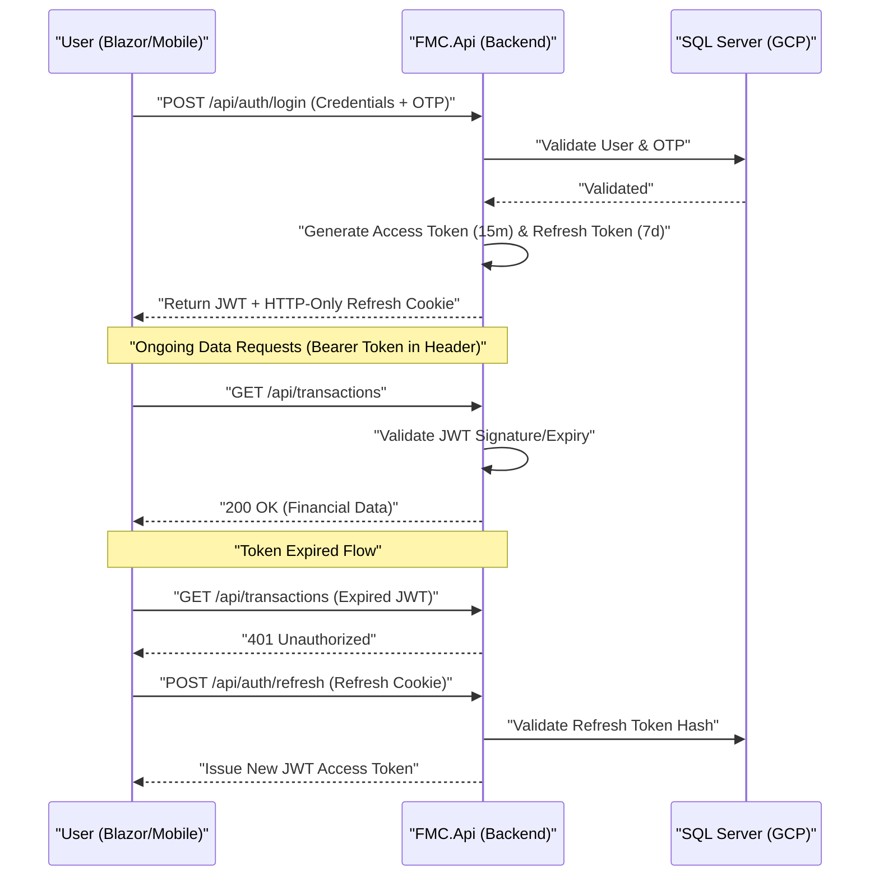

# FMC Enterprise API Roadmap & Architecture

This document defines the strategic roadmap and technical architecture for the Finance Management Console (FMC) Backend API. It aligns with the existing project milestones to move from a monolithic Blazor app to a decoupled, high-available, and secure distributed system.

---

## 🏛 Enterprise Architecture Pattern: Clean Architecture

To ensure the FMC is future-proof and "enterprise-level", we will follow a **Clean Architecture (Onion Architecture)** approach. This separates the business logic from the infrastructure and UI.

### Project Layering:
1.  **`FMC.Core` (Domain Layer)**:
    - Pure C#. Contains Domain Entities (`Transaction`, `Account`), DTOs, Mapping profiles, and Service Interfaces.
2.  **`FMC.Infrastructure` (Data Layer)**:
    - Implements the Core interfaces. Contains `ApplicationDbContext`, EF Core Migrations, Identity configurations, and external integrations (SMTP/OTP).
3.  **`FMC.Api` (Presentation/Application Layer)**:
    - ASP.NET Core Web API with Controllers. Handles Middleware (Auth, Logging, Rate Limiting) and exposes REST endpoints.
4.  **`FMC.Shared` (DTO Layer)**:
    - Lightweight library containing only DTOs and validation logic, shared between `FMC.Api` and the Blazor UI (`FMC`).

---

## 🔐 Advanced Authentication Flow (Enterprise Standard)

We will transition from simple Cookies to a session-hardened **JWT + Refresh Token** flow.

---

## 🚀 Tailored API Phases

### Phase A: Architecture Extraction (Extraction Foundation)
*Focus: Isolate the core from the UI components.*
1.  **Library Creation**: Scaffold `FMC.Core` and `FMC.Infrastructure` projects.
2.  **Model Decoupling**: Move all database entities to the Core.
3.  **DB Context Migration**: Physically move the Entity Framework layer to Infrastructure.

### Phase B: Secure REST Engine (Security & Access)
*Focus: Move Authentication and Authorization to the API.*
1.  **Identity Port**: Shift ASP.NET Identity stores to the API project.
2.  **JWT Implementation**: Configure `JwtBearer` authentication service.
3.  **Endpoint Hardening**: Implement Rate Limiting (prevent brute force) and Auto-Logging of all high-value transactions.

### Phase C: Financial Service RESTification (The Core Logic)
*Focus: Expose financial services as high-performance REST endpoints.*
1.  **Finance API**: Implement `GET/POST/PUT/DELETE` for Transactions, Accounts, and Budgets.
2.  **DTO Mapping**: Use `AutoMapper` to ensure internal DB schemas are never exposed directly to the web.
3.  **Error Handling**: Global Exception Middleware to return standardized RFC7807 problem details (JSON errors).

### Phase D: Enterprise Governance (Aligned with Roadmap v1.0)
*Focus: Supporting Phase 10-12 of the FMC Roadmap.*
1.  **Multi-Tenant API**: Middleware to automatically filter all SQL queries by `TenantID` (Family/Account group).
2.  **Ledger Integrity**: Cryptographic signing of ledger entries to ensure no "invisible" fund manipulation between Mother and Sub accounts.
3.  **SuperAdmin API**: Advanced auditing endpoints for forensic review.

---

## ✅ Best Practices Checklist
- [ ] **Versioning**: All endpoints prefixed with `/api/v1/`.
- [ ] **Documentation**: 100% OpenAPI (Swagger) coverage.
- [ ] **Performance**: Response caching for non-sensitive financial summaries.
- [ ] **Validation**: FluentValidation for all incoming request DTOs.
- [ ] **Security**: CORS policies strictly limited to the production frontend domain.
