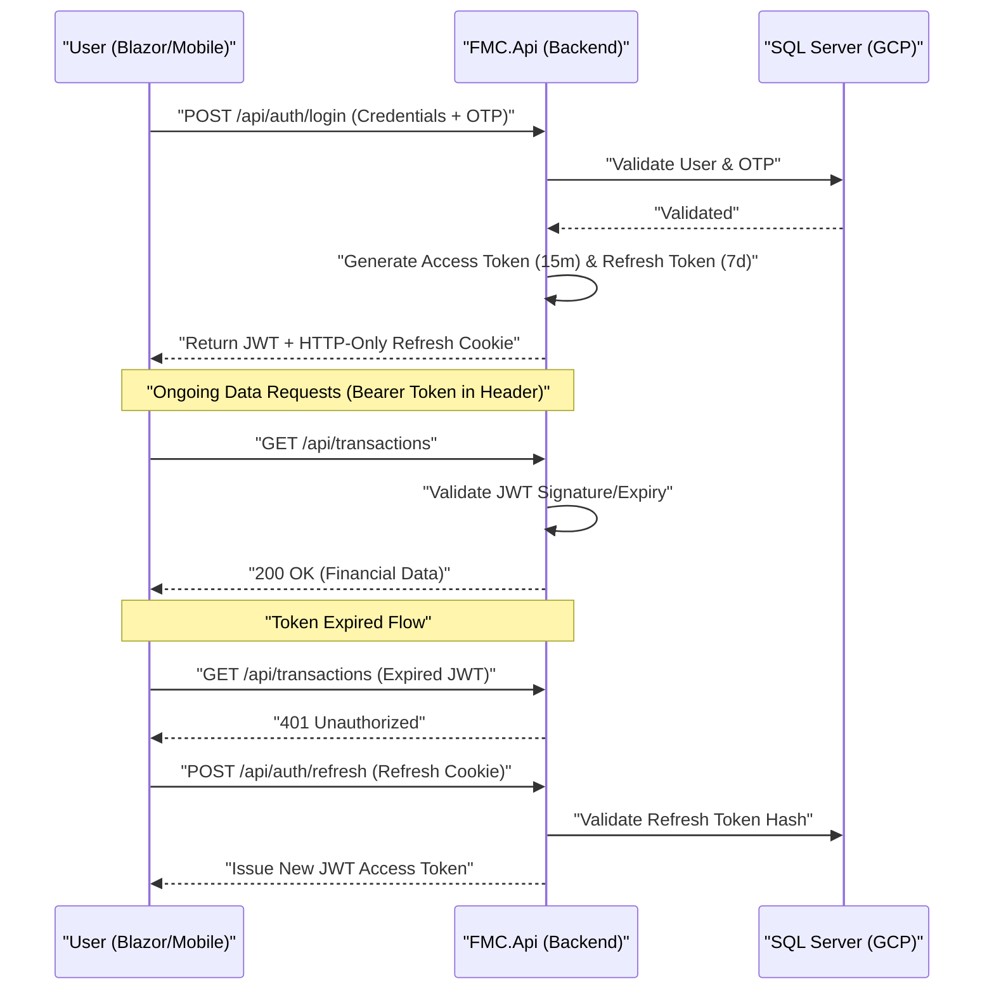

# FMC Enterprise API Roadmap & Architecture

This document defines the strategic roadmap and technical architecture for the Finance Management Console (FMC) Backend API. It aligns with the existing project milestones to move from a monolithic Blazor app to a decoupled, high-available, and secure distributed system.

---

## 🏛 Enterprise Architecture Pattern: Clean Architecture

To ensure the FMC is future-proof and "enterprise-level", we will follow a **Clean Architecture (Onion Architecture)** approach. This separates the business logic from the infrastructure and UI.

### Project Structure:
1.  **`FMC.Core` (Domain Layer)**: Pure C#. Contains Domain Entities, MediatR Command/Query models, and Service Interfaces.
2.  **`FMC.Shared` (Contract Layer)**: Lightweight library containing **DTOs** and validation logic. Shared by both the API and Blazor UI.
3.  **`FMC.Infrastructure` (Data Layer)**: Implements persistence via `ApplicationDbContext`, SQL Migrations, and external integrations (SMTP/OTP).
4.  **`FMC.Api` (Presentation/Backend)**: ASP.NET Core Web API with Controllers, JWT Auth middleware, and Swagger.
5.  **`FMC` (Frontend)**: Refactored Blazor Web App interacting with `FMC.Api` via `HttpClient`.

---

## 🧠 Architectural Resolutions

### I. Shared Library Versioning
- **Deployment Flow**: Synchronized atomic deployments via CI/CD pipelines to ensure the Blazor UI always has matching DTOs from `FMC.Shared`.
- **API Stability**: Adhere to additive-only changes for DTOs; never rename or delete properties without a version increment (`/api/v2/`).

### II. Data Access: Implementation of CQRS
- **MediatR Integration**: Decouple commands and queries within `FMC.Core`.
- **Performance**: Use optimized Dapper/EF Query models for read operations, bypass heavy business logic for high-speed dashboard telemetry.
- **Integrity**: Strict EF Core transactional boundaries for "Commands" (Writing data to account ledgers).

### III. Progressive Testing Strategy
- **Contract Security**: Implement JSON Schema validation or Pact to ensure the Blazor client and API remain in sync.
- **Resilient Integration**: Use **Testcontainers** for SQL Server to run high-fidelity tests against real database state in the CI pipeline.

---

## 🔐 Advanced Authentication Flow (Enterprise Standard)

We will transition from simple Cookies to a session-hardened **JWT + Refresh Token** flow.

---

## 🚀 Tailored API Phases

### Phase A: Architecture Extraction (Extraction Foundation)
*Focus: Isolate the core from the UI components.*
1.  **Library Creation**: Scaffold `FMC.Core`, `FMC.Shared`, and `FMC.Infrastructure`.
2.  **Model Decoupling**: Move entities to `Core` and DTOs to `Shared`.
3.  **DB Context Migration**: Physically move the Entity Framework layer to Infrastructure.

### Phase B: Secure REST Engine (Security & Access)
*Focus: Move Authentication and Authorization to the API.*
1.  **Identity Port**: Shift ASP.NET Identity stores to the API project.
2.  **JWT Implementation**: Configure `JwtBearer` authentication service.
3.  **Endpoint Hardening**: Implement Rate Limiting and Auto-Logging of all high-value transactions.

### Phase C: Financial Service RESTification (The Core Logic)
*Focus: Expose financial services as high-performance REST endpoints.*
1.  **Finance API**: Implement `GET/POST/PUT/DELETE` for Transactions, Accounts, and Budgets.
2.  **DTO Mapping**: Use `AutoMapper` and ensure internal entities are never exposed to the web.
3.  **Error Handling**: Global Exception Middleware returning standardized RFC7807 problem details.

### Phase D: Governance & Multi-Tenancy (Scale & Security)
*Focus: Support for hierarchy and isolation.*
1.  **Tenant Middleware**: Filter queries by `TenantID` (Family/Organization) at the infrastructure level.
2.  **Ledger Integrity**: Cryptographic audit trails for Mother Account transfers.
3.  **Governance API**: SuperAdmin endpoints for system-wide forensic review.

### Phase E: Advanced Edge & Distributed Caching
*Focus: High availability and performance.*
1.  **API Gateway**: Implement **YARP** for request aggregation and rate limiting.
2.  **GCP Memorystore**: Integrate **Redis** for dashboard and session caching.
3.  **Cache Warming**: Background workers to pre-calculate financial trends.
 
### Phase F: Predictive Intelligence & AI
*Focus: AI-driven financial insights.*
1.  **AI Service Core**: Wrapper for Gemini/LLM integrations.
2.  **Auto-Categorization**: Real-time NLU for transaction labels.
3.  **Anomaly API**: Automated flags for outlier financial behavior.

---

## 📡 Observability & DevOps
- **Logging**: Centralized logging via **Serilog** to GCP Cloud Logging.
- **Monitoring**: Health Checks (`/health`) and OpenTelemetry for request tracing.
- **CI/CD**: Multi-project build pipeline using GitHub Actions (Build -> Test -> Deploy).

---

## ✅ Final Enterprise Checklist
- [ ] **Versioning**: All endpoints prefixed with `/api/v1/`.
- [ ] **Documentation**: 100% OpenAPI (Swagger) coverage.
- [ ] **Validation**: FluentValidation for all incoming request DTOs.
- [ ] **Security**: Strictly enforced CORS and Secure Header policies.
